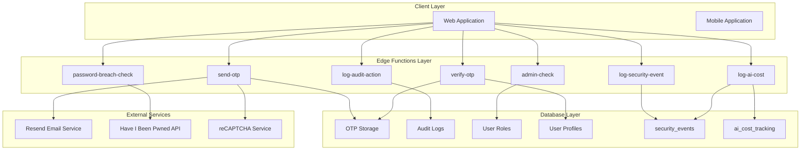
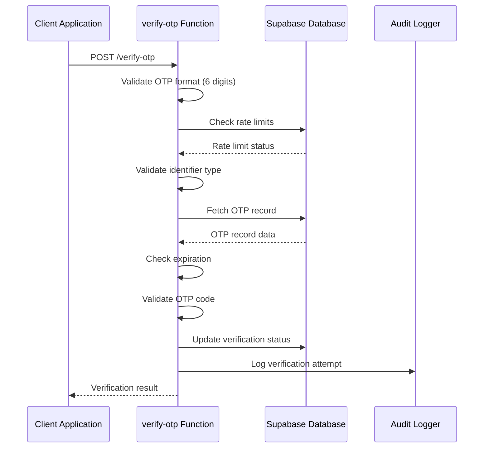
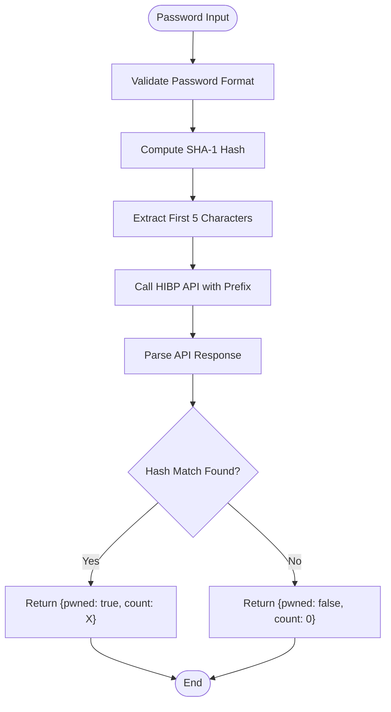
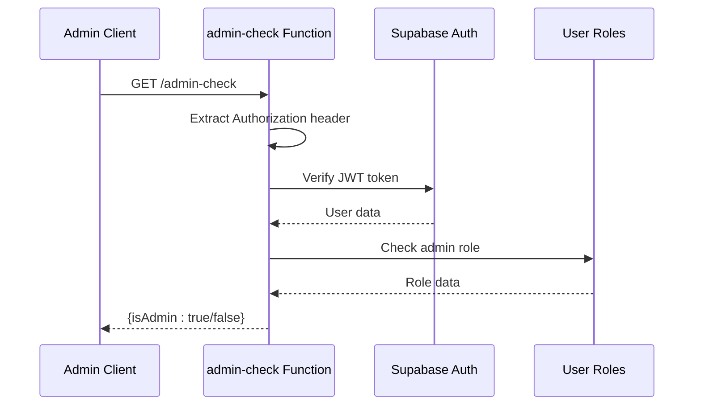
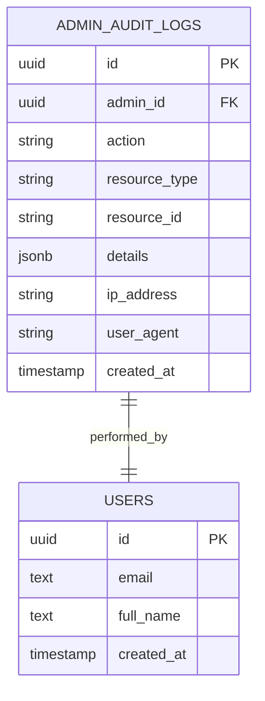
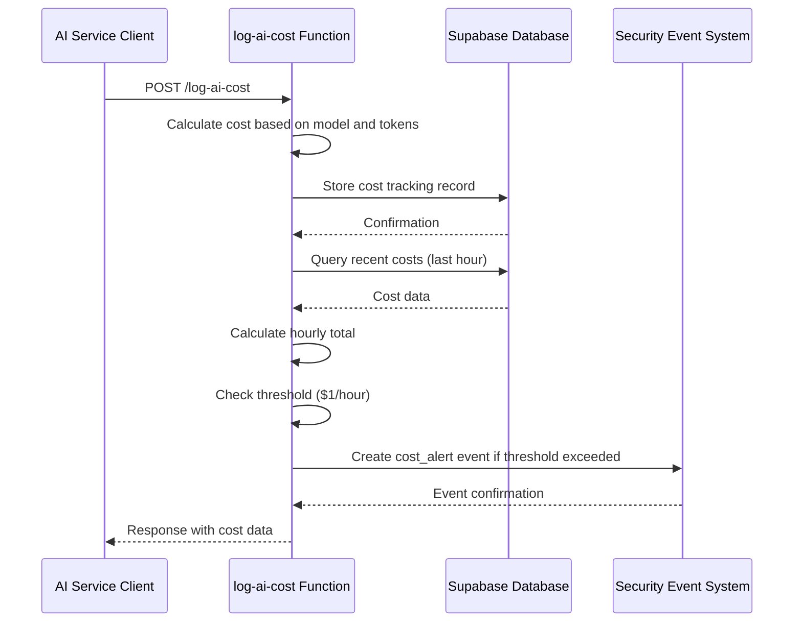
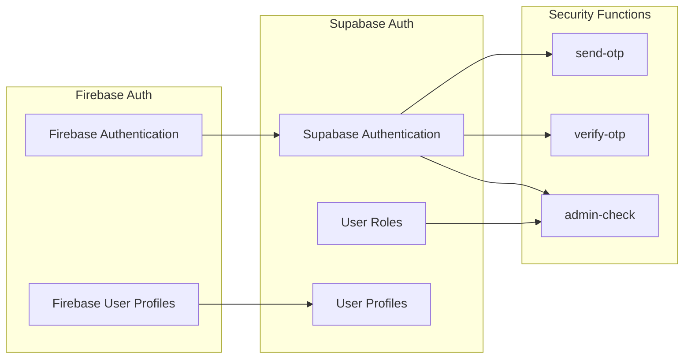

# Security Functions API

<cite>
**Referenced Files in This Document**
- [send-otp/index.ts](file://supabase/functions/send-otp/index.ts)
- [verify-otp/index.ts](file://supabase/functions/verify-otp/index.ts)
- [password-breach-check/index.ts](file://supabase/functions/password-breach-check/index.ts)
- [admin-check/index.ts](file://supabase/functions/admin-check/index.ts)
- [log-audit-action/index.ts](file://supabase/functions/log-audit-action/index.ts)
- [useFirebaseAuth.tsx](file://src/hooks/useFirebaseAuth.tsx)
- [env-validator.ts](file://src/lib/env-validator.ts)
- [auditLog.ts](file://src/lib/auditLog.ts)
- [BASE_MIGRATION_SAFE.sql](file://supabase/BASE_MIGRATION_SAFE.sql)
- [log-security-event/index.ts](file://supabase/functions/log-security-event/index.ts) - *Added in recent commit*
- [log-ai-cost/index.ts](file://supabase/functions/log-ai-cost/index.ts) - *Added in recent commit*
- [SecurityMonitoringDashboard.tsx](file://src/components/admin/SecurityMonitoringDashboard.tsx) - *Added in recent commit*
- [security_events.sql](file://supabase/migrations/20251128220157_remix_migration_from_pg_dump.sql#L1450-L1463) - *Added in recent commit*
- [ai_cost_tracking.sql](file://supabase/migrations/20251128220157_remix_migration_from_pg_dump.sql#L1049-L1075) - *Added in recent commit*
</cite>

## Update Summary
**Changes Made**
- Added new section "Real-Time Security Monitoring Functions" to document the newly added `log-security-event` and `log-ai-cost` edge functions
- Added new section "Security Monitoring Dashboard" to document the `SecurityMonitoringDashboard` component and its integration with real-time security monitoring
- Updated Table of Contents to include new sections
- Added new Mermaid diagram for real-time security event flow
- Updated document sources to include all new files related to security monitoring

## Table of Contents
1. [Introduction](#introduction)
2. [Security Function Architecture](#security-function-architecture)
3. [Two-Factor Authentication Functions](#two-factor-authentication-functions)
4. [Password Security Functions](#password-security-functions)
5. [Administrative Functions](#administrative-functions)
6. [Audit Logging System](#audit-logging-system)
7. [Real-Time Security Monitoring Functions](#real-time-security-monitoring-functions)
8. [Security Monitoring Dashboard](#security-monitoring-dashboard)
9. [Integration Patterns](#integration-patterns)
10. [Security Measures](#security-measures)
11. [Deployment and Environment Management](#deployment-and-environment-management)
12. [Monitoring and Alerting](#monitoring-and-alerting)
13. [Best Practices](#best-practices)

## Introduction

The sleekapp-v100 security functions API provides comprehensive security controls for authentication, authorization, and audit logging. Built on Supabase Edge Functions, these serverless functions implement robust security measures including two-factor authentication (2FA), password breach detection, role-based access control, and comprehensive audit trails.

The security architecture follows defense-in-depth principles, combining multiple security layers including rate limiting, input validation, cryptographic hashing, and real-time monitoring. All functions are designed to handle sensitive operations securely while maintaining high availability and performance.

## Security Function Architecture

The security functions are organized into five core categories, each serving specific security requirements:



**Diagram sources**
- [send-otp/index.ts](file://supabase/functions/send-otp/index.ts#L1-L489)
- [verify-otp/index.ts](file://supabase/functions/verify-otp/index.ts#L1-L356)
- [password-breach-check/index.ts](file://supabase/functions/password-breach-check/index.ts#L1-L142)
- [admin-check/index.ts](file://supabase/functions/admin-check/index.ts#L1-L74)
- [log-audit-action/index.ts](file://supabase/functions/log-audit-action/index.ts#L1-L97)
- [log-security-event/index.ts](file://supabase/functions/log-security-event/index.ts#L1-L61)
- [log-ai-cost/index.ts](file://supabase/functions/log-ai-cost/index.ts#L1-L96)

**Section sources**
- [send-otp/index.ts](file://supabase/functions/send-otp/index.ts#L1-L50)
- [verify-otp/index.ts](file://supabase/functions/verify-otp/index.ts#L1-L50)
- [password-breach-check/index.ts](file://supabase/functions/password-breach-check/index.ts#L1-L50)
- [admin-check/index.ts](file://supabase/functions/admin-check/index.ts#L1-L50)
- [log-audit-action/index.ts](file://supabase/functions/log-audit-action/index.ts#L1-L50)
- [log-security-event/index.ts](file://supabase/functions/log-security-event/index.ts#L1-L61)
- [log-ai-cost/index.ts](file://supabase/functions/log-ai-cost/index.ts#L1-L96)

## Two-Factor Authentication Functions

### send-otp Function

The `send-otp` function handles one-time password generation and delivery for both phone and email verification scenarios.

#### Endpoint Details
- **URL**: `/functions/v1/send-otp`
- **Method**: POST
- **Content-Type**: application/json
- **Authentication**: Public (rate-limited)

#### Request Format
```typescript
interface OTPRequest {
  type: 'phone' | 'email-quote' | 'email-supplier';
  phone?: string;
  email?: string;
  country?: string;
  captchaToken?: string;
}
```

#### Response Format
```typescript
interface OTPResponse {
  success: boolean;
  expiresAt: string;
  message: string;
}
```

#### Security Features

**Rate Limiting Implementation**:
- **Phone OTP**: 1 request per 5 minutes per phone number
- **Email OTP**: 1 request per 5 minutes per email address
- **Email Quote**: 3 requests per day per email address
- **Supplier Registration**: Requires reCAPTCHA verification

**Input Validation**:
- Comprehensive email format validation with regex
- Disposable email domain blocking
- Phone number sanitization and validation
- CAPTCHA verification for supplier registration

**Delivery Security**:
- Email templating with HTML formatting
- Retry logic with exponential backoff
- Delivery status tracking
- Header injection prevention

#### Invocation Pattern Example

```typescript
// Phone OTP Request
const { data, error } = await supabase.functions.invoke('send-otp', {
  body: { type: 'phone', phone: '+1234567890' }
});

// Email OTP Request
const { data, error } = await supabase.functions.invoke('send-otp', {
  body: { 
    type: 'email-quote', 
    email: 'user@example.com',
    captchaToken: 'recaptcha_token_here'
  }
});
```

**Section sources**
- [send-otp/index.ts](file://supabase/functions/send-otp/index.ts#L145-L250)
- [send-otp/index.ts](file://supabase/functions/send-otp/index.ts#L205-L249)

### verify-otp Function

The `verify-otp` function validates one-time passwords and completes the authentication process.

#### Endpoint Details
- **URL**: `/functions/v1/verify-otp`
- **Method**: POST
- **Content-Type**: application/json
- **Authentication**: Depends on OTP type

#### Request Format
```typescript
interface VerifyRequest {
  type: 'phone' | 'email-quote' | 'email-supplier';
  phone?: string;
  email?: string;
  otp: string;
}
```

#### Response Format
```typescript
interface VerifyResponse {
  success: boolean;
  verified: boolean;
  message: string;
  quotesUsedToday?: number;
  quotesRemaining?: number;
}
```

#### Security Features

**Rate Limiting**:
- 3 attempts per hour per identifier
- 5 attempts per OTP record
- IP-based tracking for suspicious activity

**OTP Validation**:
- Expiration checking (10-minute validity)
- Attempt counting and limiting
- Secure comparison without timing attacks
- Automatic cleanup of expired records

**User Profile Updates**:
- Automatic phone verification updates
- Session management integration
- Role assignment based on verification type

#### Verification Flow



**Diagram sources**
- [verify-otp/index.ts](file://supabase/functions/verify-otp/index.ts#L110-L146)
- [verify-otp/index.ts](file://supabase/functions/verify-otp/index.ts#L224-L288)

**Section sources**
- [verify-otp/index.ts](file://supabase/functions/verify-otp/index.ts#L14-L25)
- [verify-otp/index.ts](file://supabase/functions/verify-otp/index.ts#L36-L88)
- [verify-otp/index.ts](file://supabase/functions/verify-otp/index.ts#L90-L178)

## Password Security Functions

### password-breach-check Function

The `password-breach-check` function implements k-anonymity password validation using the Have I Been Pwned API.

#### Endpoint Details
- **URL**: `/functions/v1/password-breach-check`
- **Method**: POST
- **Content-Type**: application/json
- **Authentication**: Public (origin-restricted)

#### Request Format
```typescript
interface PasswordCheckRequest {
  password: string;
}
```

#### Response Format
```typescript
interface PasswordCheckResponse {
  pwned: boolean;
  count: number;
}
```

#### Security Features

**K-Anonymity Implementation**:
- SHA-1 hashing without revealing full passwords
- Prefix-based API calls to minimize exposure
- Fail-closed security model when HIBP is unavailable

**Origin Validation**:
- Whitelist-based CORS enforcement
- Protocol and subdomain validation
- Development vs production environment handling

**Cryptographic Security**:
- Secure SHA-1 implementation using Web Crypto API
- Proper encoding and hex conversion
- Memory-safe hash computation

#### Breach Detection Process



**Diagram sources**
- [password-breach-check/index.ts](file://supabase/functions/password-breach-check/index.ts#L106-L131)

**Section sources**
- [password-breach-check/index.ts](file://supabase/functions/password-breach-check/index.ts#L98-L141)

## Administrative Functions

### admin-check Function

The `admin-check` function verifies administrative privileges for privileged operations.

#### Endpoint Details
- **URL**: `/functions/v1/admin-check`
- **Method**: GET/POST
- **Content-Type**: application/json
- **Authentication**: JWT Token Required

#### Request Format
```typescript
// Authorization header required
Authorization: Bearer <jwt-token>
```

#### Response Format
```typescript
interface AdminCheckResponse {
  isAdmin: boolean;
  error?: string;
}
```

#### Security Features

**JWT Validation**:
- Server-side token verification
- User ID extraction from claims
- Role permission checking

**Database Security**:
- Service role key for secure database access
- Role-based permission queries
- Error handling and logging

#### Role Verification Process



**Diagram sources**
- [admin-check/index.ts](file://supabase/functions/admin-check/index.ts#L33-L60)

**Section sources**
- [admin-check/index.ts](file://supabase/functions/admin-check/index.ts#L14-L74)

## Audit Logging System

### log-audit-action Function

The `log-audit-action` function provides comprehensive audit trail capabilities for security-sensitive operations.

#### Endpoint Details
- **URL**: `/functions/v1/log-audit-action`
- **Method**: POST
- **Content-Type**: application/json
- **Authentication**: JWT Token Required

#### Request Format
```typescript
interface AuditLogRequest {
  action: string;
  resource_type: string;
  resource_id?: string;
  details?: Record<string, any>;
  user_id?: string; // Ignored - uses JWT-validated user ID
}
```

#### Response Format
```typescript
interface AuditLogResponse {
  success: boolean;
  log_id: string;
  error?: string;
}
```

#### Database Schema

The audit logging system uses the following database structure:

| Column | Type | Description | Constraints |
|--------|------|-------------|-------------|
| id | UUID | Primary key | PRIMARY KEY |
| admin_id | UUID | User performing action | NOT NULL |
| action | TEXT | Action description | NOT NULL |
| resource_type | TEXT | Resource type | NOT NULL |
| resource_id | TEXT | Resource identifier | NULLABLE |
| details | JSONB | Action details | DEFAULT {} |
| ip_address | TEXT | Client IP address | NULLABLE |
| user_agent | TEXT | Browser/User agent | NULLABLE |
| created_at | TIMESTAMP | Creation timestamp | DEFAULT now() |

#### Security Features

**Server-Side Validation**:
- JWT token verification prevents spoofing
- User ID extraction from validated tokens
- IP address capture from headers
- User agent logging for forensic analysis

**Data Protection**:
- Sanitized logging with identifier masking
- Structured audit trail format
- Timestamp precision for timeline analysis
- Resource association for correlation

#### Audit Log Structure



**Diagram sources**
- [BASE_MIGRATION_SAFE.sql](file://supabase/BASE_MIGRATION_SAFE.sql#L736-L750)

**Section sources**
- [log-audit-action/index.ts](file://supabase/functions/log-audit-action/index.ts#L8-L14)
- [log-audit-action/index.ts](file://supabase/functions/log-audit-action/index.ts#L22-L97)
- [auditLog.ts](file://src/lib/auditLog.ts#L28-L40)

## Real-Time Security Monitoring Functions

### log-security-event Function

The `log-security-event` function captures and stores security-related events for real-time monitoring and alerting.

#### Endpoint Details
- **URL**: `/functions/v1/log-security-event`
- **Method**: POST
- **Content-Type**: application/json
- **Authentication**: Public (with IP tracking)

#### Request Format
```typescript
interface SecurityEventRequest {
  event_type: 'captcha_failure' | 'rate_limit_violation' | 'suspicious_pattern' | 'cost_alert';
  severity: 'low' | 'medium' | 'high' | 'critical';
  source: string;
  details?: Record<string, any>;
  user_id?: string;
  session_id?: string;
}
```

#### Response Format
```typescript
interface SecurityEventResponse {
  success: boolean;
  error?: string;
}
```

#### Security Features

**Automatic IP and User Agent Capture**:
- Extracts client IP from x-forwarded-for or x-real-ip headers
- Captures user agent for forensic analysis
- Stores session context for pattern detection

**Event Validation**:
- Strict validation of event types and severity levels
- JSONB storage for flexible details structure
- Automatic timestamp generation

**Real-time Integration**:
- Designed to work with Supabase real-time subscriptions
- Enables immediate dashboard updates
- Supports automated alerting based on severity

#### Invocation Example

```typescript
// Log a rate limit violation
const { data, error } = await supabase.functions.invoke('log-security-event', {
  body: {
    event_type: 'rate_limit_violation',
    severity: 'medium',
    source: 'send-otp',
    details: {
      phone: '+1234567890',
      attempts: 4,
      window: '5 minutes'
    }
  }
});

// Log a suspicious pattern
const { data, error } = await supabase.functions.invoke('log-security-event', {
  body: {
    event_type: 'suspicious_pattern',
    severity: 'high',
    source: 'ai-quote-generator',
    details: {
      user_id: 'a1b2c3d4-e5f6-7890-g1h2-i3j4k5l6m7n8',
      request_pattern: 'high_volume_short_duration',
      request_count: 25,
      time_window_minutes: 2
    }
  }
});
```

**Section sources**
- [log-security-event/index.ts](file://supabase/functions/log-security-event/index.ts#L1-L61)
- [security_events.sql](file://supabase/migrations/20251128220157_remix_migration_from_pg_dump.sql#L1450-L1463)

### log-ai-cost Function

The `log-ai-cost` function tracks AI service usage and costs, with automatic alerting for cost thresholds.

#### Endpoint Details
- **URL**: `/functions/v1/log-ai-cost`
- **Method**: POST
- **Content-Type**: application/json
- **Authentication**: Public (with cost calculation)

#### Request Format
```typescript
interface AICostRequest {
  function_name: string;
  model: 'google/gemini-2.5-flash' | 'google/gemini-2.5-pro' | 'perplexity/sonar-small' | 'perplexity/sonar-large';
  request_tokens: number;
  response_tokens: number;
  session_id?: string;
  user_id?: string;
}
```

#### Response Format
```typescript
interface AICostResponse {
  success: boolean;
  estimated_cost: number;
  hourly_cost: number;
  error?: string;
}
```

#### Security Features

**Cost Calculation**:
- Pre-configured cost models for supported AI services
- Input and output token cost calculation
- Real-time cost estimation

**Automated Cost Alerting**:
- Monitors hourly cost trends
- Automatically creates security events for threshold breaches
- Critical alerts for >$5/hour, high alerts for >$1/hour

**Usage Analytics**:
- Tracks function and model usage patterns
- Enables cost optimization analysis
- Supports budget forecasting

#### Cost Monitoring Flow



**Diagram sources**
- [log-ai-cost/index.ts](file://supabase/functions/log-ai-cost/index.ts#L60-L82)
- [ai_cost_tracking.sql](file://supabase/migrations/20251128220157_remix_migration_from_pg_dump.sql#L1049-L1075)

**Section sources**
- [log-ai-cost/index.ts](file://supabase/functions/log-ai-cost/index.ts#L1-L96)
- [ai_cost_tracking.sql](file://supabase/migrations/20251128220157_remix_migration_from_pg_dump.sql#L1049-L1075)
- [shared/securityLogger.ts](file://supabase/functions/shared/securityLogger.ts#L57-L87)

## Security Monitoring Dashboard

### SecurityMonitoringDashboard Component

The `SecurityMonitoringDashboard` provides real-time visualization of security events and AI cost metrics using Supabase real-time subscriptions.

#### Component Details
- **Path**: `src/components/admin/SecurityMonitoringDashboard.tsx`
- **Dependencies**: Supabase client, React, Lucide icons, Sonner toast
- **Real-time Features**: PostgreSQL change subscriptions for immediate updates

#### Data Sources

The dashboard displays data from three main sources:

1. **Recent Security Events**: Direct query and real-time subscription to `security_events` table
2. **AI Cost Breakdown**: Query to `ai_hourly_costs` view for hourly cost analysis
3. **Weekly Security Summary**: Query to `daily_security_summary` view for aggregated event data

#### Key Metrics Displayed

| Metric | Source | Update Mechanism |
|--------|--------|------------------|
| Critical Events | security_events | Real-time subscription |
| High Priority Events | security_events | Real-time subscription |
| Daily AI Cost | ai_hourly_costs | Polling (5 min interval) |
| Total Events | security_events | Real-time subscription |

#### Real-time Subscription Implementation

```typescript
useEffect(() => {
  fetchSecurityData();
  
  // Set up real-time subscription for new security events
  const channel = supabase
    .channel('security-monitoring')
    .on(
      'postgres_changes',
      {
        event: 'INSERT',
        schema: 'public',
        table: 'security_events',
      },
      (payload) => {
        const newEvent = payload.new as SecurityEvent;
        setRecentEvents(prev => [newEvent, ...prev].slice(0, 10));
        
        // Show toast notification for critical/high severity events
        if (newEvent.severity === 'critical' || newEvent.severity === 'high') {
          toast.error(`Security Alert: ${newEvent.event_type}`, {
            description: `${newEvent.severity.toUpperCase()} - ${newEvent.source}`,
          });
        }
      }
    )
    .subscribe();

  return () => {
    supabase.removeChannel(channel);
  };
}, []);
```

#### Database Schema

**security_events Table**
| Column | Type | Description | Constraints |
|--------|------|-------------|-------------|
| id | UUID | Primary key | PRIMARY KEY |
| event_type | TEXT | Type of security event | NOT NULL, CHECK constraint |
| severity | TEXT | Severity level | NOT NULL, CHECK constraint |
| source | TEXT | Source function/component | NOT NULL |
| user_id | UUID | Associated user | NULLABLE |
| session_id | TEXT | Session identifier | NULLABLE |
| ip_address | TEXT | Client IP address | NULLABLE |
| user_agent | TEXT | Client user agent | NULLABLE |
| details | JSONB | Event-specific details | NULLABLE |
| created_at | TIMESTAMP | Creation timestamp | DEFAULT now() |

**ai_cost_tracking Table**
| Column | Type | Description | Constraints |
|--------|------|-------------|-------------|
| id | UUID | Primary key | PRIMARY KEY |
| function_name | TEXT | Calling function | NOT NULL |
| model | TEXT | AI model used | NOT NULL |
| request_tokens | INTEGER | Input tokens | NULLABLE |
| response_tokens | INTEGER | Output tokens | NULLABLE |
| estimated_cost | NUMERIC | Calculated cost in USD | NULLABLE |
| session_id | TEXT | Session identifier | NULLABLE |
| user_id | UUID | Associated user | NULLABLE |
| created_at | TIMESTAMP | Creation timestamp | DEFAULT now() |

**Views**
- `ai_hourly_costs`: Aggregates AI costs by hour, function, and model
- `daily_security_summary`: Aggregates security events by day, type, and severity

**Section sources**
- [SecurityMonitoringDashboard.tsx](file://src/components/admin/SecurityMonitoringDashboard.tsx#L1-L295)
- [security_events.sql](file://supabase/migrations/20251128220157_remix_migration_from_pg_dump.sql#L1450-L1463)
- [ai_cost_tracking.sql](file://supabase/migrations/20251128220157_remix_migration_from_pg_dump.sql#L1049-L1075)
- [types.ts](file://src/integrations/supabase/types.ts#L2824-L2841)

## Integration Patterns

### Firebase Auth Integration

The security functions integrate with Firebase Authentication for comprehensive identity management:



**Diagram sources**
- [useFirebaseAuth.tsx](file://src/hooks/useFirebaseAuth.tsx#L1-L92)

### Supabase Functions Invocation

All security functions are invoked using the standardized Supabase functions client:

```typescript
// Standard invocation pattern
const { data, error } = await supabase.functions.invoke(functionName, {
  body: requestPayload
});
```

**Section sources**
- [useFirebaseAuth.tsx](file://src/hooks/useFirebaseAuth.tsx#L1-L92)

## Security Measures

### Rate Limiting Implementation

The security functions implement multiple layers of rate limiting:

| Function | Rate Limit Type | Limit | Window |
|----------|----------------|-------|---------|
| send-otp (phone) | Per phone number | 1 request | 5 minutes |
| send-otp (email) | Per email address | 1 request | 5 minutes |
| send-otp (email-quote) | Per email address | 3 requests | 24 hours |
| verify-otp | Per identifier | 3 attempts | 1 hour |
| verify-otp (per OTP) | Per OTP record | 5 attempts | N/A |

### OTP Security Features

**Expiration Management**:
- 10-minute OTP validity period
- Automatic cleanup of expired records
- Graceful degradation for expired codes

**Attempt Control**:
- Configurable attempt limits per OTP
- Suspicious activity detection
- Automatic account lockout prevention

**Storage Security**:
- Encrypted OTP storage
- Secure deletion after verification
- Audit trail for all attempts

### Cryptographic Security

**Password Hashing**:
- SHA-1 implementation for HIBP API compliance
- Secure random OTP generation
- Timing attack resistance

**JWT Security**:
- Server-side token validation
- User ID extraction from claims
- Role-based access control

**Section sources**
- [send-otp/index.ts](file://supabase/functions/send-otp/index.ts#L205-L249)
- [verify-otp/index.ts](file://supabase/functions/verify-otp/index.ts#L67-L88)
- [verify-otp/index.ts](file://supabase/functions/verify-otp/index.ts#L226-L262)

## Deployment and Environment Management

### Environment Variable Management

The security functions rely on several critical environment variables:

| Variable | Purpose | Security Level |
|----------|---------|----------------|
| RESEND_API_KEY | Email delivery service | Secret |
| SUPABASE_URL | Supabase database URL | Public |
| SUPABASE_SERVICE_ROLE_KEY | Database access | Secret |
| SUPABASE_ANON_KEY | Anonymous access | Public |
| RECAPTCHA_SECRET_KEY | Bot protection | Secret |

### Environment Validation

The application includes comprehensive environment validation:

```typescript
// Environment validation ensures all required variables are present
const envValidator = EnvironmentValidator.getInstance();
envValidator.validate(); // Throws error if validation fails
```

### Secure Deployment Practices

**Configuration Management**:
- Environment-specific configurations
- Secret rotation procedures
- Access control for deployment keys

**Monitoring Setup**:
- Function execution monitoring
- Error rate tracking
- Performance metrics collection

**Section sources**
- [env-validator.ts](file://src/lib/env-validator.ts#L1-L143)

## Monitoring and Alerting

### Real-Time Monitoring

The security functions implement comprehensive monitoring:

**Rate Limiting Alerts**:
- Excessive request patterns
- Failed verification attempts
- Suspicious IP addresses

**Security Event Tracking**:
- Failed authentication attempts
- Unauthorized access attempts
- Role elevation events
- AI service cost threshold breaches

**Performance Metrics**:
- Function execution times
- Database query performance
- External service response times

### Audit Trail Analysis

The audit logging system enables comprehensive security analysis:

**Suspicious Activity Detection**:
- Multiple failed verification attempts
- Unusual geographic patterns
- Automated attack patterns
- High-frequency AI service usage

**Compliance Reporting**:
- User action tracking
- Administrative changes
- Data access patterns
- Cost tracking for AI services

## Best Practices

### Development Guidelines

**Secure Coding Practices**:
- Input validation for all parameters
- Error handling without information leakage
- Secure logging with sensitive data masking
- Proper resource cleanup

**Testing Strategies**:
- Unit testing for security logic
- Integration testing with external services
- Load testing for rate limiting
- Security penetration testing

### Operational Procedures

**Incident Response**:
- Immediate response to security incidents
- User notification procedures
- Service restoration protocols
- Post-incident analysis

**Maintenance Tasks**:
- Regular security audits
- Dependency updates
- Performance optimization
- Backup verification

### Compliance Considerations

**Data Protection**:
- GDPR compliance for user data
- Data retention policies
- Right to erasure implementation
- Data minimization principles

**Regulatory Requirements**:
- Authentication standards
- Audit trail requirements
- Security certification
- Third-party assessments