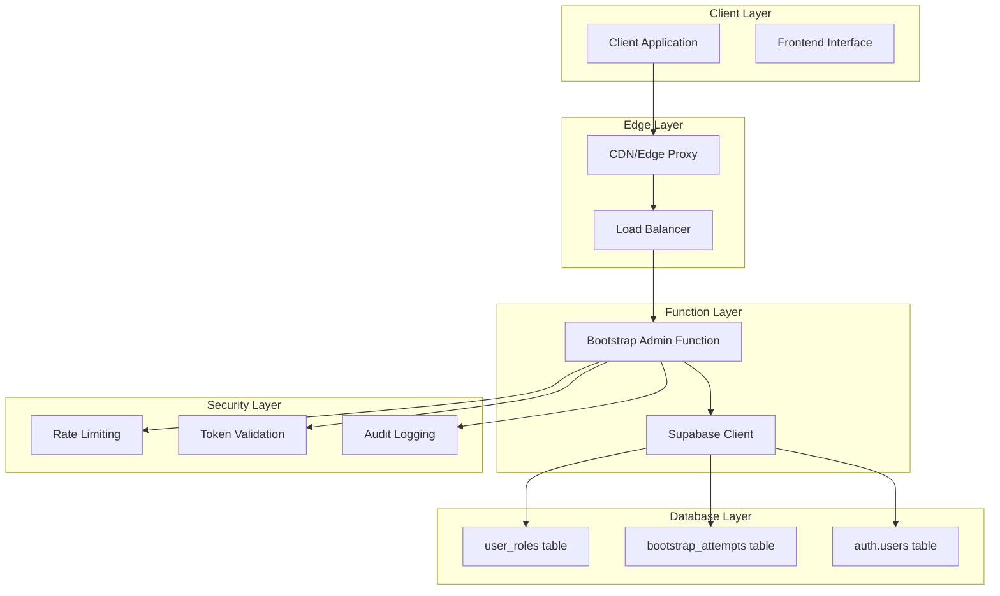
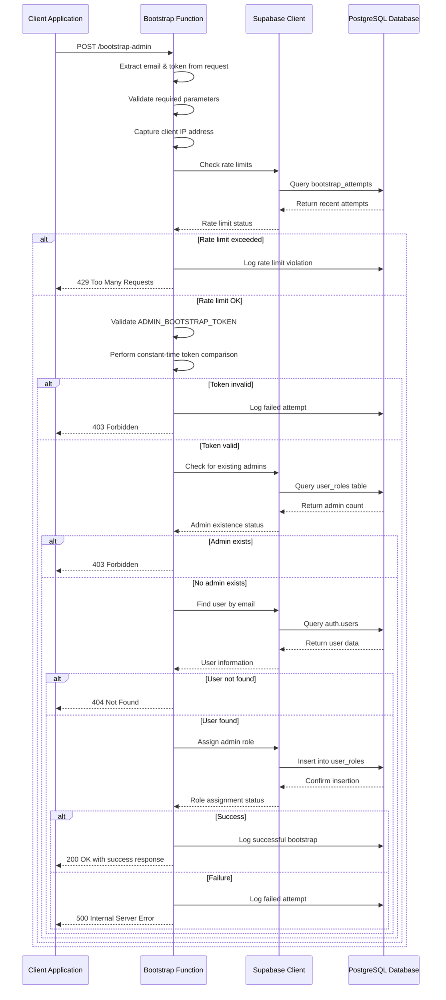
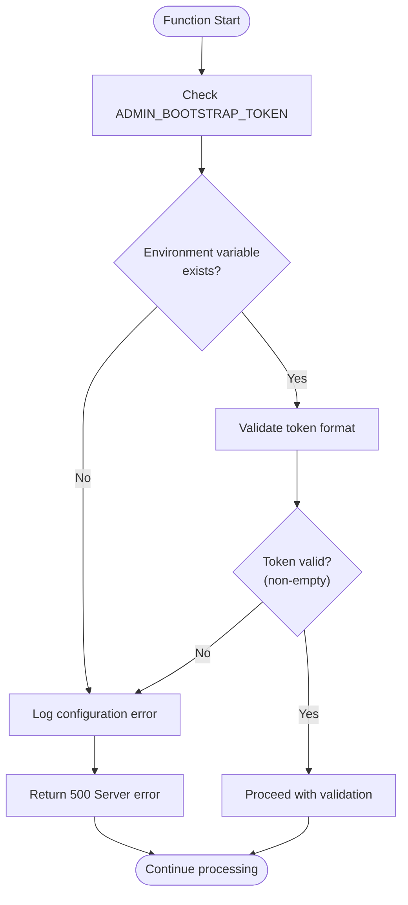
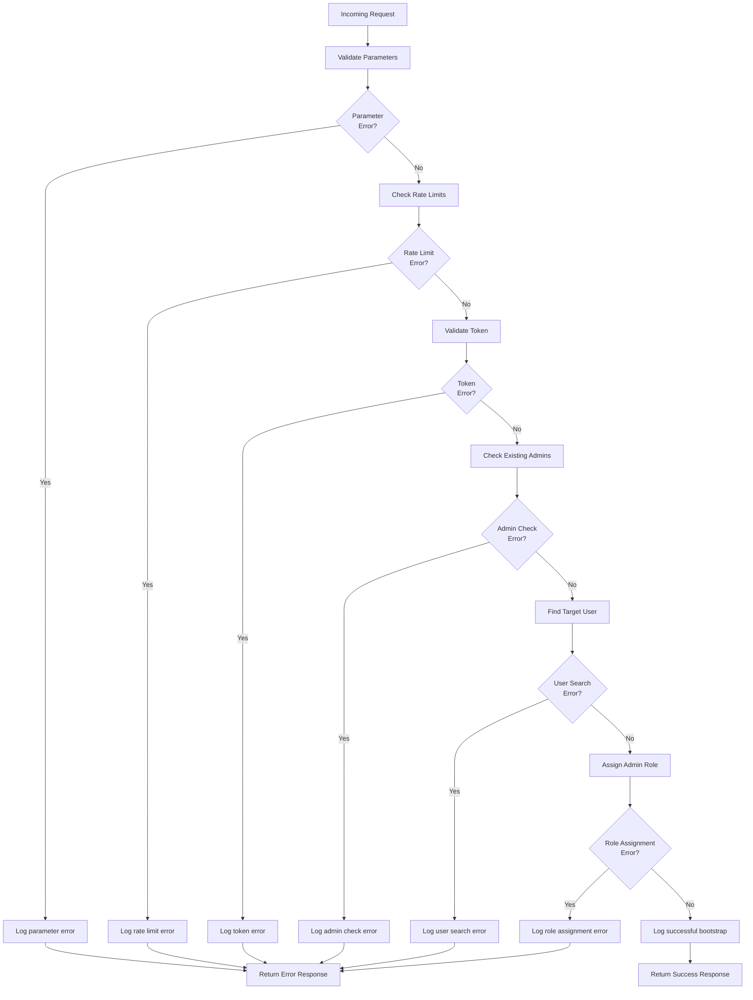

# Admin Provisioning System

<cite>
**Referenced Files in This Document**
- [supabase/functions/bootstrap-admin/index.ts](file://supabase\functions\bootstrap-admin\index.ts) - *Updated in recent commit*
- [src/pages/SetupAdmin.tsx](file://src\pages\SetupAdmin.tsx) - *Added in recent commit*
- [supabase/config.toml](file://supabase\config.toml) - *Modified in recent commit*
- [supabase/COMPLETE_SETUP.sql](file://supabase\COMPLETE_SETUP.sql) - *Updated in recent commit*
- [src/lib/env-validator.ts](file://src\lib\env-validator.ts) - *Modified in recent commit*
- [SECURITY.md](file://SECURITY.md) - *Updated in recent commit*
</cite>

## Update Summary
**Changes Made**
- Updated documentation to reflect replacement of setup-first-admin endpoint with secure bootstrap-admin system
- Added details about the SetupAdmin page and ADMIN_BOOTSTRAP_TOKEN requirement
- Updated code examples and workflow descriptions to match current implementation
- Enhanced security considerations with new token validation details
- Added troubleshooting guidance for token configuration issues

## Table of Contents
1. [Introduction](#introduction)
2. [System Architecture](#system-architecture)
3. [Bootstrap Admin Function](#bootstrap-admin-function)
4. [Security Mechanisms](#security-mechanisms)
5. [Database Schema](#database-schema)
6. [Error Handling](#error-handling)
7. [Operational Best Practices](#operational-best-practices)
8. [Troubleshooting Guide](#troubleshooting-guide)
9. [Production Deployment](#production-deployment)
10. [Conclusion](#conclusion)

## Introduction

The Admin Provisioning System in sleekapp-v100 provides a secure mechanism for initial admin user creation through a token-based bootstrap process. This system implements multiple layers of security including IP-based rate limiting, constant-time token comparison to prevent timing attacks, and comprehensive audit logging to ensure accountability and security compliance.

The bootstrap-admin function serves as the primary entry point for establishing administrative privileges during system initialization, while maintaining strict security controls to prevent unauthorized access and abuse.

## System Architecture

The admin provisioning system follows a serverless architecture built on Deno Functions with Supabase backend services. The system consists of several interconnected components that work together to provide secure admin provisioning capabilities.



**Diagram sources**
- [supabase/functions/bootstrap-admin/index.ts](file://supabase\functions\bootstrap-admin\index.ts#L1-L178)
- [supabase/config.toml](file://supabase\config.toml#L9-L11)

**Section sources**
- [supabase/functions/bootstrap-admin/index.ts](file://supabase\functions\bootstrap-admin\index.ts#L1-L178)
- [supabase/config.toml](file://supabase\config.toml#L1-L73)

## Bootstrap Admin Function

The bootstrap-admin function implements a comprehensive security protocol for initial admin user creation. The function validates incoming requests through multiple security layers before granting administrative privileges.

### Request Processing Workflow



**Diagram sources**
- [supabase/functions/bootstrap-admin/index.ts](file://supabase\functions\bootstrap-admin\index.ts#L19-L177)

### Core Function Implementation

The bootstrap-admin function implements several critical security features:

#### Parameter Validation
The function begins by validating incoming request parameters to ensure both email and token are present in the JSON payload. This prevents malformed requests from proceeding through the security pipeline.

#### IP-Based Rate Limiting
The system implements a sophisticated rate limiting mechanism that tracks failed attempts per IP address over a one-hour window. The implementation uses the following logic:

- Captures client IP from HTTP headers (`x-forwarded-for`, `x-real-ip`)
- Queries the `bootstrap_attempts` table for recent failed attempts
- Enforces a maximum of 3 attempts per IP address per hour
- Logs rate limit violations for audit purposes

#### Constant-Time Token Comparison
To prevent timing attacks, the system implements a constant-time comparison algorithm that ensures the comparison operation takes the same amount of time regardless of whether the tokens match. This prevents attackers from gaining information about the token structure through timing analysis.

**Section sources**
- [supabase/functions/bootstrap-admin/index.ts](file://supabase\functions\bootstrap-admin\index.ts#L19-L177)

## Security Mechanisms

The admin provisioning system implements multiple layers of security to protect against various attack vectors and ensure system integrity.

### Environment Variable Protection

The system relies on the `ADMIN_BOOTSTRAP_TOKEN` environment variable for authentication. Proper environment variable management is crucial for system security:



**Diagram sources**
- [supabase/functions/bootstrap-admin/index.ts](file://supabase\functions\bootstrap-admin\index.ts#L60-L68)

### Prevention of Multiple Admin Bootstrapping

The system implements strict checks to prevent multiple administrators from being created:

- **Single Admin Enforcement**: Before assigning the admin role, the system queries the `user_roles` table to check if any admin users already exist
- **Atomic Operations**: Role assignments are performed as atomic database operations to prevent race conditions
- **Immediate Validation**: The system validates admin existence immediately before attempting role assignment

### Secure Logging Practices

All bootstrap attempts are logged to the `bootstrap_attempts` table with comprehensive audit trails:

| Field | Purpose | Security Impact |
|-------|---------|-----------------|
| `id` | Unique identifier | Enables correlation of events |
| `ip_address` | Client source | Supports forensic analysis |
| `success` | Operation outcome | Tracks attack patterns |
| `created_at` | Timestamp | Provides temporal context |

**Section sources**
- [supabase/functions/bootstrap-admin/index.ts](file://supabase\functions\bootstrap-admin\index.ts#L60-L177)
- [supabase/COMPLETE_SETUP.sql](file://supabase\COMPLETE_SETUP.sql#L7657-L7674)

## Database Schema

The admin provisioning system relies on several database tables that implement Row Level Security (RLS) for enhanced security.

### Bootstrap Attempts Table

The `bootstrap_attempts` table serves as the foundation for rate limiting and audit logging:

```sql
CREATE TABLE IF NOT EXISTS public.bootstrap_attempts (
  id UUID PRIMARY KEY DEFAULT gen_random_uuid(),
  ip_address TEXT NOT NULL,
  success BOOLEAN NOT NULL DEFAULT false,
  created_at TIMESTAMPTZ NOT NULL DEFAULT now()
);

-- Enable RLS
ALTER TABLE public.bootstrap_attempts ENABLE ROW LEVEL SECURITY;

-- Security policy
CREATE POLICY "Service role manages bootstrap attempts"
ON public.bootstrap_attempts FOR ALL
USING (auth.role() = 'service_role')
WITH CHECK (auth.role() = 'service_role');

-- Index for efficient queries
CREATE INDEX IF NOT EXISTS idx_bootstrap_attempts_ip_time 
ON public.bootstrap_attempts(ip_address, created_at DESC);
```

### User Roles Table

The `user_roles` table manages user permissions and admin assignments:

```sql
CREATE TYPE public.app_role AS ENUM (
    'retailer',
    'wholesaler',
    'educational',
    'corporate',
    'sports_team',
    'factory',
    'admin',
    'supplier'
);

CREATE TABLE IF NOT EXISTS public.user_roles (
  user_id UUID REFERENCES auth.users(id),
  role public.app_role NOT NULL,
  PRIMARY KEY (user_id, role)
);
```

### Security Policies

The system implements strict security policies to prevent unauthorized access:

- **Service Role Access**: Only the Supabase service role can access bootstrap attempts
- **Row Level Security**: All tables implement RLS to restrict data access
- **Index Optimization**: Strategic indexing supports efficient rate limiting queries

**Section sources**
- [supabase/COMPLETE_SETUP.sql](file://supabase\COMPLETE_SETUP.sql#L7657-L7674)

## Error Handling

The bootstrap-admin function implements comprehensive error handling across all security checkpoints to provide appropriate feedback while maintaining security.

### Error Categories and Responses

| Error Type | HTTP Status | Security Impact | Client Response |
|------------|-------------|-----------------|-----------------|
| Missing Parameters | 400 Bad Request | Information leakage risk | "Missing email or token" |
| Rate Limit Exceeded | 429 Too Many Requests | DDoS protection | "Too many attempts. Try again in 1 hour." |
| Invalid Token | 403 Forbidden | Authentication failure | "Invalid token" |
| Admin Exists | 403 Forbidden | Authorization bypass | "Admin already exists. Bootstrap disabled for security." |
| User Not Found | 404 Not Found | Information leakage risk | "User not found with that email" |
| Database Error | 500 Internal Server Error | System stability | "Database error" |
| Server Config | 500 Internal Server Error | Configuration issue | "Server configuration error" |

### Logging and Monitoring

The system implements comprehensive logging for security monitoring:



**Diagram sources**
- [supabase/functions/bootstrap-admin/index.ts](file://supabase\functions\bootstrap-admin\index.ts#L21-L177)

**Section sources**
- [supabase/functions/bootstrap-admin/index.ts](file://supabase\functions\bootstrap-admin\index.ts#L21-L177)

## Operational Best Practices

### Environment Configuration

Proper environment variable management is critical for system security:

1. **Secure Token Generation**: Generate strong random tokens using cryptographically secure methods
2. **Environment Isolation**: Store tokens in separate environment configurations (development, staging, production)
3. **Rotation Schedule**: Implement regular token rotation procedures
4. **Access Control**: Restrict access to environment variables to authorized personnel only

### Monitoring and Alerting

Implement comprehensive monitoring for security events:

- **Rate Limit Violations**: Monitor for unusual patterns of rate limit bypass attempts
- **Failed Attempts**: Track failed bootstrap attempts for potential attack detection
- **Successful Bootstraps**: Monitor successful admin role assignments
- **System Errors**: Alert on database connectivity or configuration issues

### Backup and Recovery

Ensure system resilience through proper backup strategies:

- **Database Backups**: Regular backups of bootstrap_attempts and user_roles tables
- **Configuration Backups**: Backup of environment variables and function configurations
- **Recovery Procedures**: Documented procedures for restoring from backup in case of compromise

## Troubleshooting Guide

### Common Issues and Solutions

#### Token Expiration or Mismatch

**Symptoms**: "Invalid token" error responses
**Causes**: 
- Token mismatch between client and server configuration
- Environment variable not properly set
- Token corruption during transmission

**Solutions**:
1. Verify `ADMIN_BOOTSTRAP_TOKEN` environment variable is correctly set
2. Check for token encoding/decoding issues in client implementation
3. Validate token format matches exactly (including whitespace)

#### Rate Limiting Issues

**Symptoms**: "Too many attempts. Try again in 1 hour." error
**Causes**:
- Multiple failed attempts from same IP address
- Rate limit counter not resetting properly
- Network proxy causing IP address issues

**Solutions**:
1. Wait for the one-hour reset period
2. Check network configuration for proper IP header forwarding
3. Implement retry logic with exponential backoff in client applications

#### User Not Found Errors

**Symptoms**: "User not found with that email" error
**Causes**:
- User does not exist in Supabase auth system
- Email spelling or formatting issues
- User account deactivated or deleted

**Solutions**:
1. Verify user exists in Supabase dashboard
2. Check email formatting and spelling
3. Ensure user account is active and not suspended

#### Database Connection Issues

**Symptoms**: "Database error" or "Failed to find user" errors
**Causes**:
- Supabase service role key misconfiguration
- Database connectivity problems
- Insufficient permissions for service role

**Solutions**:
1. Verify `SUPABASE_SERVICE_ROLE_KEY` environment variable
2. Check Supabase dashboard for service role status
3. Review database connection settings and firewall rules

### Debugging Procedures

#### Enable Detailed Logging

Add debug logging to capture detailed information about failures:

```typescript
// Add to bootstrap-admin/index.ts
console.debug('Bootstrap attempt details:', {
  email: email,
  clientIP: clientIP,
  tokenLength: token.length,
  adminTokenLength: ADMIN_BOOTSTRAP_TOKEN?.length,
  timestamp: new Date().toISOString()
});
```

#### Test Environment Setup

Create isolated testing environments to validate system behavior:

1. **Development Testing**: Test with known good tokens and user accounts
2. **Integration Testing**: Validate end-to-end workflow with realistic scenarios
3. **Security Testing**: Penetration testing to identify potential vulnerabilities

**Section sources**
- [supabase/functions/bootstrap-admin/index.ts](file://supabase\functions\bootstrap-admin\index.ts#L21-L177)

## Production Deployment

### Security Hardening

Deploy the bootstrap-admin function with additional security measures:

1. **Network Security**: Deploy behind a web application firewall (WAF)
2. **Access Controls**: Implement IP whitelisting for bootstrap requests
3. **Monitoring**: Deploy comprehensive monitoring and alerting
4. **Incident Response**: Establish procedures for responding to security incidents

### Performance Optimization

Optimize the function for production workloads:

- **Caching**: Implement caching for frequently accessed user data
- **Connection Pooling**: Optimize database connection management
- **Timeout Configuration**: Set appropriate timeout values for database operations
- **Resource Limits**: Configure memory and CPU limits for Deno functions

### Compliance Considerations

Ensure compliance with relevant regulations:

- **Audit Trails**: Maintain comprehensive audit logs for regulatory requirements
- **Data Protection**: Implement data protection measures for sensitive information
- **Access Controls**: Enforce strict access controls for administrative functions
- **Documentation**: Maintain documentation for security procedures and compliance

**Section sources**
- [supabase/config.toml](file://supabase\config.toml#L9-L11)
- [SECURITY.md](file://SECURITY.md#L1-L22)

## Conclusion

The Admin Provisioning System in sleekapp-v100 demonstrates a comprehensive approach to secure administrative access control. Through the implementation of multiple security layers including IP-based rate limiting, constant-time token comparison, and comprehensive audit logging, the system provides robust protection against unauthorized access attempts.

Key security features include:

- **Defense in Depth**: Multiple security layers work together to provide comprehensive protection
- **Attack Mitigation**: Specific protections against timing attacks, brute force attempts, and rate limiting bypass
- **Auditability**: Complete audit trails enable forensic analysis and compliance reporting
- **Resilience**: Robust error handling and logging support system maintenance and incident response

The system's design prioritizes security while maintaining usability for legitimate administrative provisioning scenarios. Proper deployment and operational procedures ensure the system remains effective in protecting against evolving security threats.