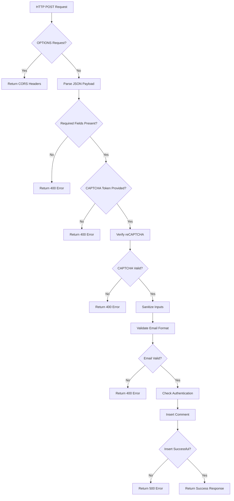
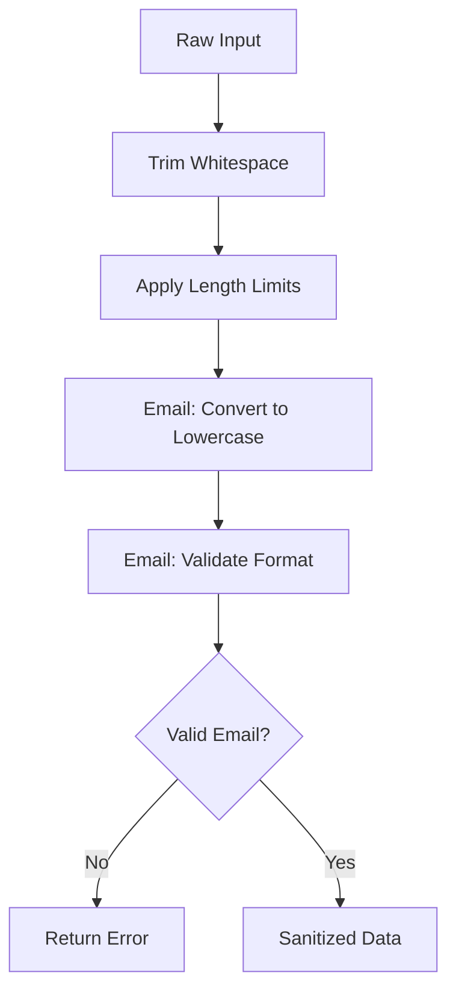
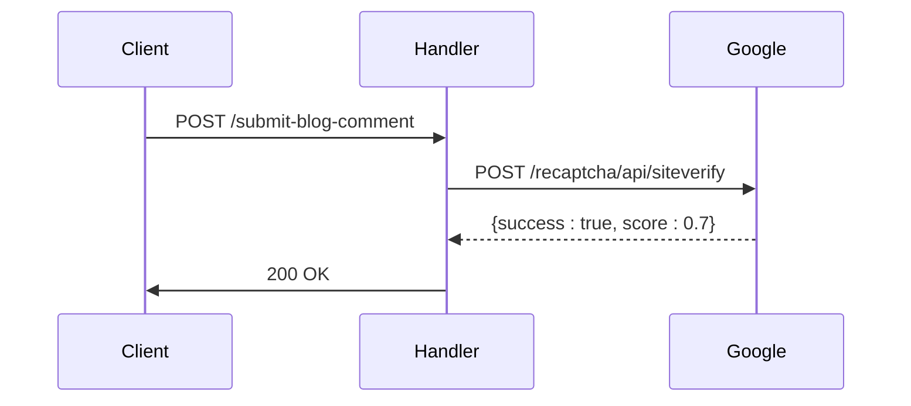
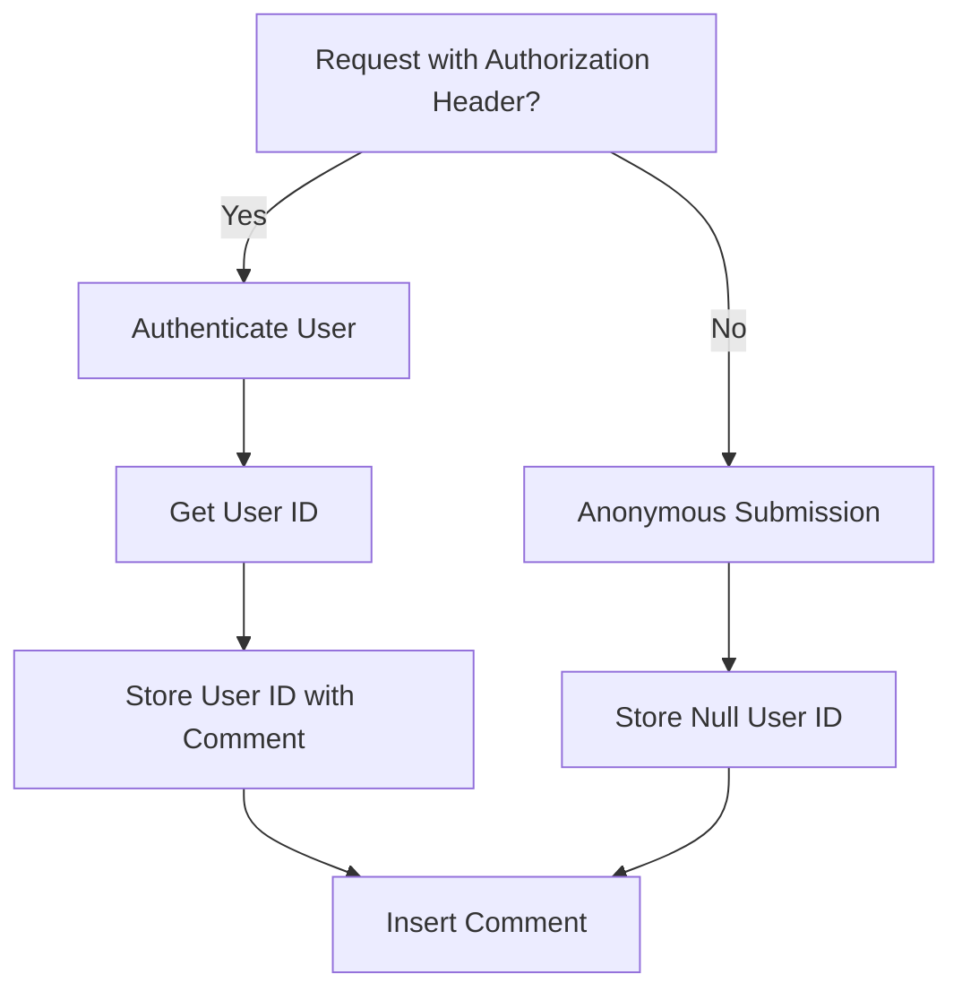
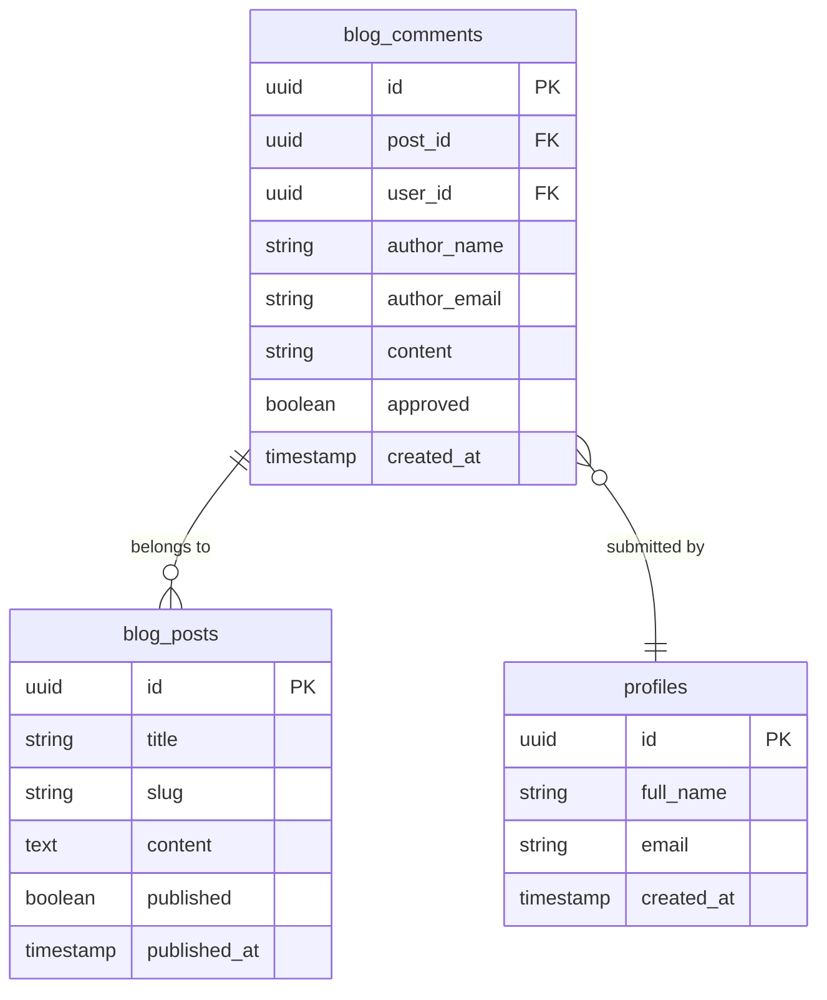
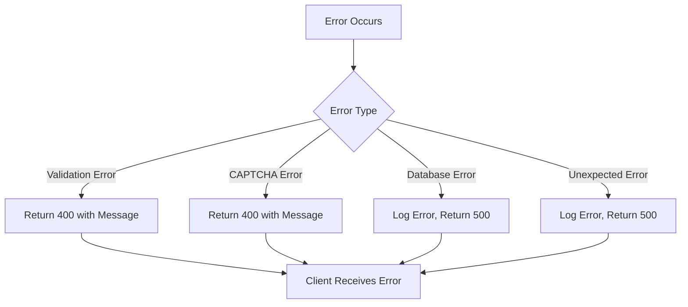
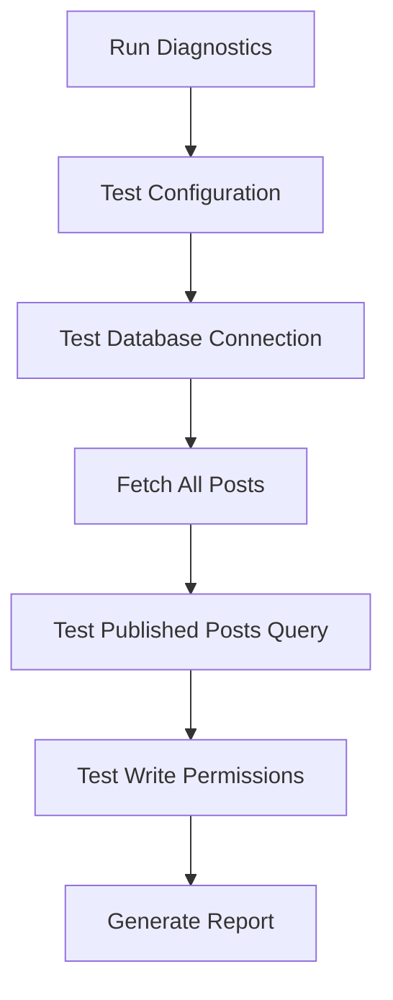

# Blog Comment Submission Handler

<cite>
**Referenced Files in This Document**   
- [submit-blog-comment/index.ts](file://supabase\functions\submit-blog-comment\index.ts) - *Updated with enhanced error handling and logging*
- [BlogErrorBoundary.tsx](file://src\components\blog\BlogErrorBoundary.tsx) - *Integrated for frontend error handling*
- [blogDebugger.ts](file://src\lib\blogDebugger.ts) - *Added diagnostic utility for blog data*
- [check_blog_posts.sql](file://supabase\check_blog_posts.sql) - *SQL script for blog data validation*
- [BlogPostCard.tsx](file://src\components\blog\BlogPostCard.tsx)
- [database.ts](file://src\types\database.ts)
- [FIXED_SETUP_PART1.sql](file://supabase\FIXED_SETUP_PART1.sql)
</cite>

## Update Summary
**Changes Made**   
- Enhanced error handling with detailed logging using emoji indicators
- Integrated BlogErrorBoundary component for robust frontend error management
- Added diagnostic tools including blogDebugger.ts utility for debugging blog data issues
- Included SQL scripts for database inspection and validation
- Updated documentation to reflect comprehensive logging practices and diagnostic workflows

## Table of Contents
1. [Introduction](#introduction)
2. [Function Overview](#function-overview)
3. [Input Validation and Sanitization](#input-validation-and-sanitization)
4. [reCAPTCHA Integration](#recaptcha-integration)
5. [Authentication Support](#authentication-support)
6. [Database Interaction](#database-interaction)
7. [Response Format](#response-format)
8. [Error Handling](#error-handling)
9. [Frontend Integration](#frontend-integration)
10. [Moderation Workflow](#moderation-workflow)
11. [Security Practices](#security-practices)
12. [Request and Response Examples](#request-and-response-examples)
13. [Diagnostic Tools](#diagnostic-tools)

## Introduction

The blog comment submission handler is a serverless function in the sleekapp-v100 application that securely processes user comments on blog posts. This webhook endpoint accepts HTTP POST requests containing comment data, validates and sanitizes inputs, verifies reCAPTCHA tokens to prevent spam, and stores comments in the database with an initial approval status of false, requiring administrative review before publication. The handler supports both authenticated users and anonymous submitters, providing a flexible commenting system while maintaining security and data integrity.

**Section sources**
- [submit-blog-comment/index.ts](file://supabase\functions\submit-blog-comment\index.ts#L1-L128)

## Function Overview

The blog comment submission handler is implemented as a Deno serverless function within the Supabase ecosystem. It serves as the backend endpoint for the blog commenting system, receiving comment submissions from the frontend and processing them according to security and business rules. The function is designed to be stateless and scalable, handling each comment submission independently with proper error handling and response formatting.

The handler follows a structured processing flow:
1. Handle CORS preflight requests
2. Parse and validate incoming JSON payload
3. Verify reCAPTCHA token with Google's API
4. Sanitize and validate input data
5. Check user authentication status
6. Insert comment into the database
7. Return appropriate response to the client



**Diagram sources**
- [submit-blog-comment/index.ts](file://supabase\functions\submit-blog-comment\index.ts#L11-L128)

**Section sources**
- [submit-blog-comment/index.ts](file://supabase\functions\submit-blog-comment\index.ts#L1-L128)

## Input Validation and Sanitization

The handler implements comprehensive input validation and sanitization to ensure data integrity and security. All incoming data is validated against required fields, with specific validation rules applied to different input types.

The following fields are required for comment submission:
- postId: The ID of the blog post being commented on
- authorName: The name of the comment author
- authorEmail: The email address of the comment author
- content: The comment content
- captchaToken: The reCAPTCHA token for spam prevention

Input sanitization is performed to prevent XSS attacks and ensure data consistency:
- Content is trimmed and limited to 5000 characters
- Author name is trimmed and limited to 100 characters
- Email is trimmed, converted to lowercase, and limited to 255 characters

Email format validation uses a regular expression pattern to ensure the email address follows standard format conventions before processing.



**Diagram sources**
- [submit-blog-comment/index.ts](file://supabase\functions\submit-blog-comment\index.ts#L54-L66)

**Section sources**
- [submit-blog-comment/index.ts](file://supabase\functions\submit-blog-comment\index.ts#L19-L66)

## reCAPTCHA Integration

The handler integrates with Google's reCAPTCHA service to prevent automated spam submissions. This security measure requires clients to complete a CAPTCHA challenge before submitting a comment, with the resulting token being verified by the server.

The reCAPTCHA verification process:
1. The client obtains a reCAPTCHA token from Google's reCAPTCHA service
2. The token is included in the comment submission request
3. The server sends the token and secret key to Google's verification API
4. Google returns a response indicating the token's validity and risk score
5. The server validates the response and proceeds only if verification succeeds

The handler uses the RECAPTCHA_SECRET_KEY environment variable to authenticate with Google's API. The verification response includes a success flag and a risk score, with submissions requiring a score of at least 0.5 to be accepted.



**Diagram sources**
- [submit-blog-comment/index.ts](file://supabase\functions\submit-blog-comment\index.ts#L35-L52)

**Section sources**
- [submit-blog-comment/index.ts](file://supabase\functions\submit-blog-comment\index.ts#L27-L52)

## Authentication Support

The handler supports dual authentication methods, allowing both authenticated users and anonymous commenters. This flexible approach accommodates users who have accounts with the platform as well as visitors who wish to comment without creating an account.

For authenticated users:
- The Authorization header is checked in the incoming request
- If present, the handler creates a Supabase client with the provided token
- The user's identity is retrieved using Supabase auth.getUser()
- The user ID is stored with the comment in the database

For anonymous users:
- No Authorization header is required
- The user_id field in the database is set to null
- Comments are still subject to the same validation and moderation processes

This dual approach provides flexibility while maintaining security through the reCAPTCHA requirement for all submissions.



**Diagram sources**
- [submit-blog-comment/index.ts](file://supabase\functions\submit-blog-comment\index.ts#L73-L88)

**Section sources**
- [submit-blog-comment/index.ts](file://supabase\functions\submit-blog-comment\index.ts#L73-L88)

## Database Interaction

The handler interacts with the Supabase PostgreSQL database to store comment data in the blog_comments table. The function uses the Supabase service role key to perform database operations with appropriate permissions.

The comment insertion process:
1. A Supabase client is created using the service role key
2. The sanitized comment data is inserted into the blog_comments table
3. The approved field is set to false by default
4. The inserted comment data is returned via the .select().single() chain

The blog_comments table schema includes the following fields:
- id: UUID primary key
- post_id: UUID referencing the blog post
- user_id: UUID referencing the user (nullable)
- author_name: Text field for the comment author's name
- author_email: Text field for the comment author's email
- content: Text field for the comment content
- approved: Boolean flag indicating moderation status
- created_at: Timestamp of comment creation



**Diagram sources**
- [submit-blog-comment/index.ts](file://supabase\functions\submit-blog-comment\index.ts#L91-L103)
- [FIXED_SETUP_PART1.sql](file://supabase\FIXED_SETUP_PART1.sql#L173-L182)
- [database.ts](file://src\types\database.ts#L104-L113)

**Section sources**
- [submit-blog-comment/index.ts](file://supabase\functions\submit-blog-comment\index.ts#L68-L103)
- [FIXED_SETUP_PART1.sql](file://supabase\FIXED_SETUP_PART1.sql#L173-L182)
- [database.ts](file://src\types\database.ts#L104-L113)

## Response Format

The handler returns standardized JSON responses with appropriate HTTP status codes to communicate the result of comment submission attempts. The response format includes success status, descriptive messages, and relevant data when applicable.

Successful response (HTTP 200):
```json
{
  "success": true,
  "message": "Comment submitted successfully and is pending approval",
  "comment_id": "uuid-string"
}
```

Error responses include appropriate HTTP status codes and descriptive messages:
- 400 Bad Request: Missing fields, invalid email, or CAPTCHA failure
- 500 Internal Server Error: Database insertion failure or unexpected errors

The response includes CORS headers to enable cross-origin requests from the frontend application, allowing the blog commenting system to work seamlessly across different domains.

**Section sources**
- [submit-blog-comment/index.ts](file://supabase\functions\submit-blog-comment\index.ts#L112-L119)

## Error Handling

The handler implements comprehensive error handling with detailed logging using emoji indicators to enhance debugging visibility. Errors are caught and logged appropriately, with user-friendly messages returned to the client.

The primary error conditions handled:
- Missing required fields (400 Bad Request)
- Missing CAPTCHA token (400 Bad Request)
- CAPTCHA verification failure (400 Bad Request)
- Invalid email format (400 Bad Request)
- Database insertion errors (500 Internal Server Error)
- Unexpected exceptions (500 Internal Server Error)

All errors are logged to the server console with emoji indicators for quick identification:
- 🔍 for input validation checks
- 🛡️ for security-related operations
- 💾 for database operations
- ❌ for error conditions
- ✅ for successful operations



**Diagram sources**
- [submit-blog-comment/index.ts](file://supabase\functions\submit-blog-comment\index.ts#L121-L127)

**Section sources**
- [submit-blog-comment/index.ts](file://supabase\functions\submit-blog-comment\index.ts#L20-L25, L28-L32, L60-L65, L104-L110, L121-L127)

## Frontend Integration

The blog comment submission handler is integrated with the frontend BlogPostCard component, which provides the user interface for submitting comments. The integration follows a standard pattern of collecting user input, generating a reCAPTCHA token, and submitting the data to the webhook endpoint.

The integration now includes the BlogErrorBoundary component to handle any rendering or data fetching errors gracefully. This component provides a fallback UI when errors occur, logs error details to the console, and offers users options to retry, reload, or navigate home.

The frontend implementation:
1. Renders a comment submission form within the BlogPostCard component
2. Collects author name, email, and comment content
3. Generates a reCAPTCHA token when the form is submitted
4. Sends a POST request to the submit-blog-comment function
5. Handles the response and provides user feedback
6. Wraps critical components with BlogErrorBoundary for error resilience

**Section sources**
- [BlogPostCard.tsx](file://src\components\blog\BlogPostCard.tsx#L1-L72)
- [BlogPost.tsx](file://src\pages\BlogPost.tsx#L1-L252)
- [BlogErrorBoundary.tsx](file://src\components\blog\BlogErrorBoundary.tsx#L1-L175)

## Moderation Workflow

All submitted comments enter a moderation workflow where they are initially stored with an approved status of false. This ensures that comments are reviewed by administrators before appearing on the public blog.

The moderation process:
1. Comment is submitted and stored with approved=false
2. Administrators are notified of the new comment (implementation not shown)
3. Administrators review the comment in the admin interface
4. Administrators approve or reject the comment
5. Approved comments are displayed on the blog post

The admin interface for blog management (AdminBlogEditor) provides tools for reviewing and managing comments, although the specific comment moderation interface is not detailed in the available code.

**Section sources**
- [submit-blog-comment/index.ts](file://supabase\functions\submit-blog-comment\index.ts#L99-L99)
- [AdminBlogEditor.tsx](file://src\pages\AdminBlogEditor.tsx#L1-L325)

## Security Practices

The handler implements multiple security practices to protect against common web vulnerabilities:

1. **Input Validation**: All required fields are validated, and email format is verified using a regular expression.

2. **Input Sanitization**: User inputs are trimmed and length-limited to prevent XSS attacks and database issues.

3. **reCAPTCHA Protection**: Google's reCAPTCHA service is used to prevent automated spam submissions.

4. **CORS Headers**: Proper CORS headers are set to control cross-origin requests.

5. **Secure Database Access**: The service role key is used for database operations, with appropriate permission scoping.

6. **Error Handling**: Errors are handled gracefully without exposing sensitive information.

7. **Authentication Verification**: When provided, authentication tokens are verified through Supabase's auth system.

Rate limiting considerations are not explicitly implemented in the handler but could be added at the API gateway level or through Supabase's built-in rate limiting features.

**Section sources**
- [submit-blog-comment/index.ts](file://supabase\functions\submit-blog-comment\index.ts#L4-L7, L54-L58, L60-L66)

## Request and Response Examples

### Request Payload Example
```json
{
  "postId": "123e4567-e89b-12d3-a456-426614174000",
  "authorName": "Jane Doe",
  "authorEmail": "jane.doe@example.com",
  "content": "This is a great article with valuable insights.",
  "captchaToken": "03AHJ_ASjnLA214ksgdafsdf"
}
```

### Success Response Example
```json
{
  "success": true,
  "message": "Comment submitted successfully and is pending approval",
  "comment_id": "abc123-def456-ghi789"
}
```

### Error Response Example (Missing Fields)
```json
{
  "success": false,
  "message": "Missing required fields"
}
```

### Error Response Example (CAPTCHA Failure)
```json
{
  "success": false,
  "message": "CAPTCHA verification failed. Please try again."
}
```

These examples demonstrate the expected format for interacting with the blog comment submission handler, enabling frontend developers to implement the commenting functionality correctly.

**Section sources**
- [submit-blog-comment/index.ts](file://supabase\functions\submit-blog-comment\index.ts#L17-L119)

## Diagnostic Tools

Comprehensive diagnostic tools have been added to support debugging and monitoring of the blog comment system.

### blogDebugger.ts Utility

The `blogDebugger.ts` utility provides comprehensive diagnostics for blog data fetching issues. It includes functions to:
- Test Supabase configuration and connection status
- Verify database connectivity
- Check read/write permissions
- Validate blog post data integrity
- Run full diagnostic reports with emoji indicators

Key functions:
- `debugBlogDataFetching()`: Comprehensive connection and data validation
- `verifyBlogPost(idOrSlug)`: Verify specific blog post existence
- `runBlogDiagnostics()`: Execute full diagnostic suite



**Section sources**
- [blogDebugger.ts](file://src\lib\blogDebugger.ts#L1-L246)

### SQL Diagnostic Scripts

The `check_blog_posts.sql` script provides database-level inspection capabilities:
- Verify table existence and structure
- Count total and published posts
- Check data integrity issues
- Validate RLS policies
- Test sample queries used by the frontend

The script can be executed directly in the database to diagnose data-related issues.

**Section sources**
- [check_blog_posts.sql](file://supabase\check_blog_posts.sql#L1-L104)