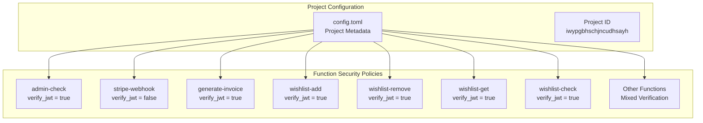
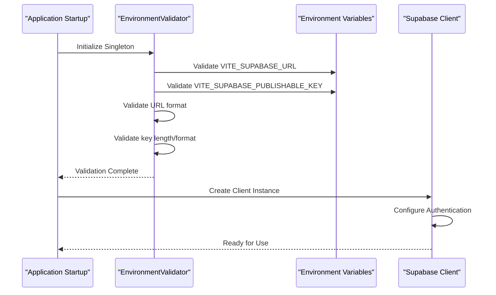
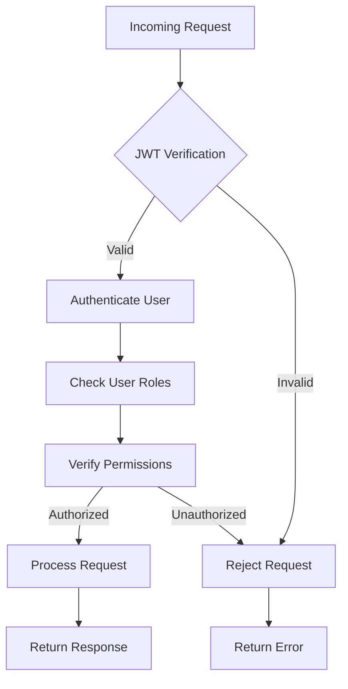
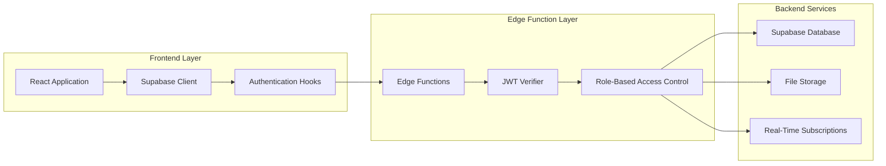
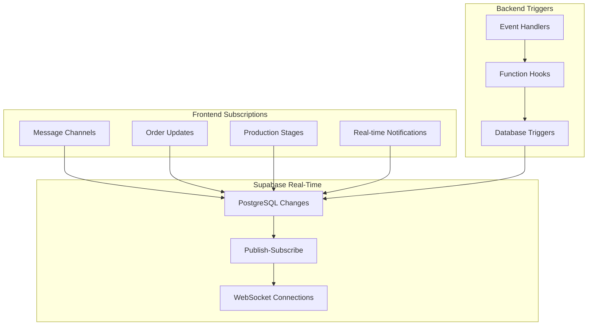
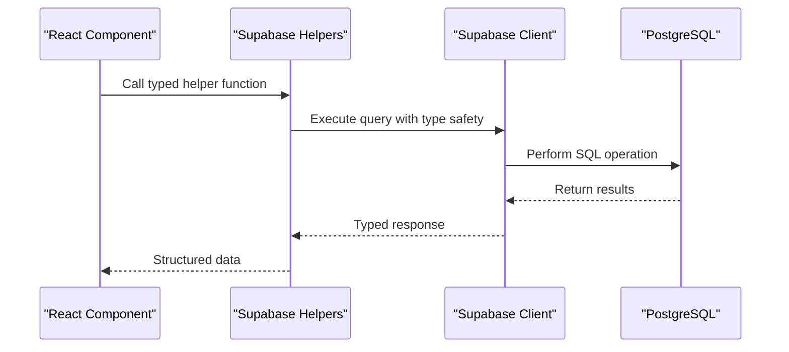

# Supabase Configuration Architecture

<cite>
**Referenced Files in This Document**
- [config.toml](file://supabase/config.toml)
- [env-validator.ts](file://src/lib/env-validator.ts)
- [client.ts](file://src/integrations/supabase/client.ts)
- [types.ts](file://src/integrations/supabase/types.ts)
- [admin-check/index.ts](file://supabase/functions/admin-check/index.ts)
- [stripe-webhook/index.ts](file://supabase/functions/stripe-webhook/index.ts)
- [wishlist-add/index.ts](file://supabase/functions/wishlist-add/index.ts)
- [bootstrap-admin/index.ts](file://supabase/functions/bootstrap-admin/index.ts)
- [generate-invoice/index.ts](file://supabase/functions/generate-invoice/index.ts)
- [useAdminAuth.ts](file://src/hooks/useAdminAuth.ts)
- [supabaseHelpers.ts](file://src/lib/supabaseHelpers.ts)
- [package.json](file://package.json)
- [index.html](file://index.html) - *Updated Supabase URL in CSP and DNS prefetch*
- [vite.config.ts](file://vite.config.ts) - *Removed hardcoded Supabase URL and publishable key*
- [performanceOptimizer.ts](file://src/lib/performanceOptimizer.ts) - *Updated DNS targets for Supabase*
</cite>

## Update Summary
**Changes Made**
- Updated Supabase project URL from `eqpftggctumujhutomom` to `iwypgbhschjncudhsayh` in all relevant configuration files
- Removed hardcoded Supabase URL and publishable key from `vite.config.ts` as part of Firebase to Supabase migration
- Updated Content Security Policy (CSP) directives in `index.html` to reflect new Supabase URL
- Updated DNS prefetch and preconnect targets in `index.html` for performance optimization
- Updated performance optimizer DNS targets to use new Supabase project URL
- Removed obsolete project ID references from documentation diagrams and examples

## Table of Contents
1. [Introduction](#introduction)
2. [Project-Level Configuration](#project-level-configuration)
3. [Frontend Client Initialization](#frontend-client-initialization)
4. [Function-Level JWT Verification Settings](#function-level-jwt-verification-settings)
5. [Integration Architecture](#integration-architecture)
6. [Security Implications](#security-implications)
7. [Real-Time Subscriptions](#real-time-subscriptions)
8. [API Access Patterns](#api-access-patterns)
9. [Configuration Best Practices](#configuration-best-practices)
10. [Version Compatibility](#version-compatibility)
11. [Troubleshooting Guide](#troubleshooting-guide)

## Introduction

The sleekapp-v100 application implements a comprehensive Supabase configuration that enables secure, real-time communication between the frontend React application and backend Edge Functions. This architecture leverages Supabase's built-in authentication, database, storage, and real-time capabilities while maintaining strict security controls through configurable JWT verification settings.

The configuration follows a multi-layered approach where project-level settings define function-level security policies, frontend clients are initialized with validated environment variables, and backend functions implement granular access controls based on user roles and permissions. Recent updates have migrated the application from Firebase to Supabase, resulting in changes to the Supabase project URL and configuration approach.

## Project-Level Configuration

### Config.toml Structure

The project-level configuration is managed through the `supabase/config.toml` file, which defines function-level JWT verification settings and project metadata.



**Diagram sources**
- [config.toml](file://supabase/config.toml#L1-L73)

### Configuration Categories

The configuration defines several categories of functions with different security requirements:

| Function Category | JWT Verification | Rationale |
|------------------|------------------|-----------|
| **High-Security** | `verify_jwt = true` | Administrative functions requiring authenticated users |
| **External Webhooks** | `verify_jwt = false` | Third-party integrations with external signatures |
| **Authenticated APIs** | `verify_jwt = true` | User-facing features requiring session validation |
| **Public APIs** | `verify_jwt = false` | Read-only operations accessible without authentication |

**Section sources**
- [config.toml](file://supabase/config.toml#L1-L73)

## Frontend Client Initialization

### Environment Validation

The frontend initialization process begins with comprehensive environment validation using the `env-validator.ts` module, which ensures all required Supabase configuration is present and properly formatted.



**Diagram sources**
- [env-validator.ts](file://src/lib/env-validator.ts#L1-L143)
- [client.ts](file://src/integrations/supabase/client.ts#L1-L20)

### Client Configuration

The Supabase client is initialized with specific authentication settings optimized for the application's needs:

```typescript
// Authentication configuration
auth: {
  storage: localStorage,           // Persistent session storage
  persistSession: true,           // Maintain sessions across browser restarts
  autoRefreshToken: true,         // Automatic token refresh
}
```

**Section sources**
- [client.ts](file://src/integrations/supabase/client.ts#L14-L20)
- [env-validator.ts](file://src/lib/env-validator.ts#L30-L50)

## Function-Level JWT Verification Settings

### Security Rationale

The JWT verification settings are carefully configured based on each function's security requirements and threat model.

#### Functions with `verify_jwt = true`

These functions require authenticated users and implement additional security checks:



**Diagram sources**
- [admin-check/index.ts](file://supabase/functions/admin-check/index.ts#L15-L74)
- [generate-invoice/index.ts](file://supabase/functions/generate-invoice/index.ts#L19-L243)

#### Functions with `verify_jwt = false`

These functions handle external integrations or public operations where JWT verification is not appropriate:

**Section sources**
- [stripe-webhook/index.ts](file://supabase/functions/stripe-webhook/index.ts#L1-L114)
- [bootstrap-admin/index.ts](file://supabase/functions/bootstrap-admin/index.ts#L1-L178)

### Specific Function Analysis

#### Admin-Only Functions (`verify_jwt = true`)
- **admin-check**: Validates administrative privileges using role-based access control
- **generate-invoice**: Requires user authentication and ownership verification
- **initialize-production-stages**: Administrative workflow management
- **execute-automation-rules**: System-wide automation control

#### Public/External Functions (`verify_jwt = false`)
- **stripe-webhook**: Handles payment notifications with Stripe signature verification
- **bootstrap-admin**: Initial admin setup with token-based authentication
- **resend-webhook**: Email delivery notifications
- **submit-blog-comment**: Community interaction without full authentication

**Section sources**
- [config.toml](file://supabase/config.toml#L15-L73)

## Integration Architecture

### Multi-Tier Security Model

The application implements a layered security approach combining frontend validation, backend authentication, and function-level authorization:



**Diagram sources**
- [client.ts](file://src/integrations/supabase/client.ts#L1-L20)
- [useAdminAuth.ts](file://src/hooks/useAdminAuth.ts#L1-L47)
- [supabaseHelpers.ts](file://src/lib/supabaseHelpers.ts#L1-L376)

### Authentication Flow

The authentication process involves multiple steps across the application stack:

1. **Frontend Session Management**: Local storage persistence with automatic token refresh
2. **Edge Function Authentication**: JWT verification and user role validation
3. **Database Access Control**: Row-level security and function-level permissions
4. **Real-Time Security**: Channel-based access control for live updates

**Section sources**
- [useAdminAuth.ts](file://src/hooks/useAdminAuth.ts#L14-L47)
- [supabaseHelpers.ts](file://src/lib/supabaseHelpers.ts#L22-L30)

## Security Implications

### JWT Verification Impact

The choice between `verify_jwt = true` and `verify_jwt = false` has significant security implications:

#### When to Use `verify_jwt = true`
- **Administrative Operations**: Functions requiring elevated privileges
- **Sensitive Data Access**: Operations involving confidential information
- **State-Changing Actions**: Functions that modify system state
- **Multi-User Systems**: Applications with distinct user roles

#### When to Use `verify_jwt = false`
- **Third-Party Integrations**: Webhooks from external services
- **Public APIs**: Read-only operations accessible to all users
- **Automated Processes**: Background tasks without user context
- **Rate-Limited Operations**: Functions with built-in protection mechanisms

### Security Best Practices

1. **Principle of Least Privilege**: Grant minimal necessary permissions
2. **Input Validation**: Validate all incoming data regardless of JWT setting
3. **Rate Limiting**: Implement rate limits for all public-facing functions
4. **Audit Logging**: Log all security-relevant events
5. **Error Handling**: Provide generic error messages to prevent information leakage

**Section sources**
- [admin-check/index.ts](file://supabase/functions/admin-check/index.ts#L44-L60)
- [generate-invoice/index.ts](file://supabase/functions/generate-invoice/index.ts#L95-L106)

## Real-Time Subscriptions

### Subscription Architecture

The application leverages Supabase's real-time capabilities for live updates across multiple features:



**Diagram sources**
- [useRealtimeMessages.ts](file://src/hooks/useRealtimeMessages.ts#L1-L61)
- [CommunicationCenter.tsx](file://src/components/shared/CommunicationCenter.tsx#L38-L83)

### Subscription Implementation Patterns

#### Message Real-Time Updates
- **Channels**: Separate channels for sent and received messages
- **Filters**: User-specific filtering using `recipient_id` and `sender_id`
- **Event Types**: Supports INSERT, UPDATE, and DELETE operations

#### Production Monitoring
- **Table-Level**: Full table subscriptions for production stages
- **Row-Level**: Individual row updates for specific orders
- **Batch Processing**: Efficient handling of multiple concurrent updates

**Section sources**
- [useRealtimeMessages.ts](file://src/hooks/useRealtimeMessages.ts#L17-L61)
- [CommunicationCenter.tsx](file://src/components/shared/CommunicationCenter.tsx#L45-L83)

## API Access Patterns

### CRUD Operations

The application implements standardized patterns for database operations through helper functions:



**Diagram sources**
- [supabaseHelpers.ts](file://src/lib/supabaseHelpers.ts#L22-L30)

### Query Optimization

The helper functions provide several benefits:

1. **Type Safety**: Compile-time type checking for database operations
2. **Consistency**: Standardized query patterns across the application
3. **Error Handling**: Centralized error management and reporting
4. **Relationship Management**: Easy handling of joined queries and relationships

**Section sources**
- [supabaseHelpers.ts](file://src/lib/supabaseHelpers.ts#L30-L376)

## Configuration Best Practices

### Environment Management

1. **Validation**: Always validate environment variables at startup
2. **Separation**: Keep sensitive keys separate from public configuration
3. **Version Control**: Never commit secrets to version control
4. **Rotation**: Regularly rotate API keys and service account credentials

### Function Configuration

1. **Security First**: Default to `verify_jwt = true` and disable only when necessary
2. **Documentation**: Clearly document the security rationale for each function
3. **Testing**: Thoroughly test both authenticated and unauthenticated scenarios
4. **Monitoring**: Monitor function access patterns and security events

### Database Security

1. **Row-Level Security**: Implement appropriate RLS policies
2. **Function Permissions**: Restrict function access to authorized users
3. **Audit Trails**: Log all database access and modifications
4. **Backup Strategy**: Regular backups with proper retention policies

**Section sources**
- [env-validator.ts](file://src/lib/env-validator.ts#L30-L50)
- [config.toml](file://supabase/config.toml#L1-L73)

## Version Compatibility

### Library Versions

The application maintains specific version compatibility for Supabase components:

| Component | Version | Purpose |
|-----------|---------|---------|
| `@supabase/supabase-js` | ^2.58.0 | Frontend client library |
| `@supabase/supabase-js` | ^2.39.3 | Backend function dependencies |
| `supabase` | ^2.58.5 | CLI and local development |

### Migration Considerations

When upgrading Supabase versions:

1. **Test Thoroughly**: Validate all authentication flows and function calls
2. **Check Breaking Changes**: Review Supabase release notes for breaking changes
3. **Update Dependencies**: Synchronize frontend and backend library versions
4. **Monitor Performance**: Watch for any changes in API response times

**Section sources**
- [package.json](file://package.json#L44-L45)

## Troubleshooting Guide

### Common Issues

#### Authentication Problems
- **Symptom**: Functions return 401 Unauthorized
- **Cause**: JWT verification failure or expired tokens
- **Solution**: Check token validity and refresh mechanism

#### Real-Time Connection Issues
- **Symptom**: Live updates not appearing
- **Cause**: WebSocket connection failures or channel subscription errors
- **Solution**: Verify network connectivity and subscription filters

#### Function Access Denied
- **Symptom**: Functions return 403 Forbidden
- **Cause**: Insufficient permissions or incorrect role assignments
- **Solution**: Review user roles and function access policies

### Debugging Tools

1. **Browser Console**: Monitor network requests and authentication status
2. **Supabase Dashboard**: View function logs and database activity
3. **Network Tab**: Inspect WebSocket connections and real-time traffic
4. **Error Tracking**: Implement comprehensive error logging and monitoring

### Performance Optimization

1. **Query Optimization**: Use indexed columns and limit result sets
2. **Subscription Management**: Properly unsubscribe from channels when components unmount
3. **Caching Strategy**: Implement appropriate caching for frequently accessed data
4. **Batch Operations**: Group related database operations when possible

**Section sources**
- [env-validator.ts](file://src/lib/env-validator.ts#L130-L143)
- [useRealtimeMessages.ts](file://src/hooks/useRealtimeMessages.ts#L55-L61)