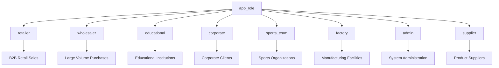
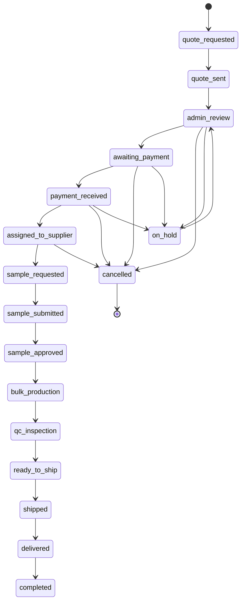
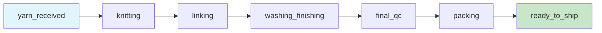
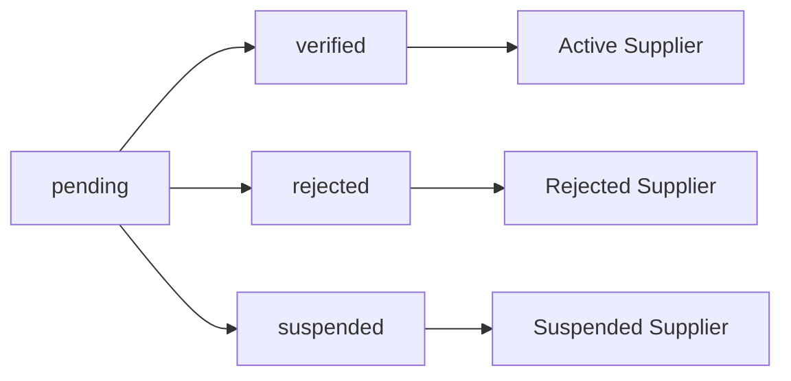
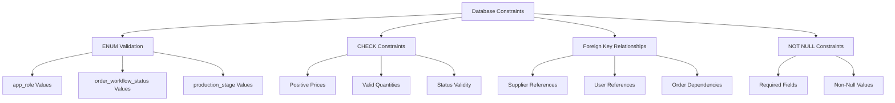
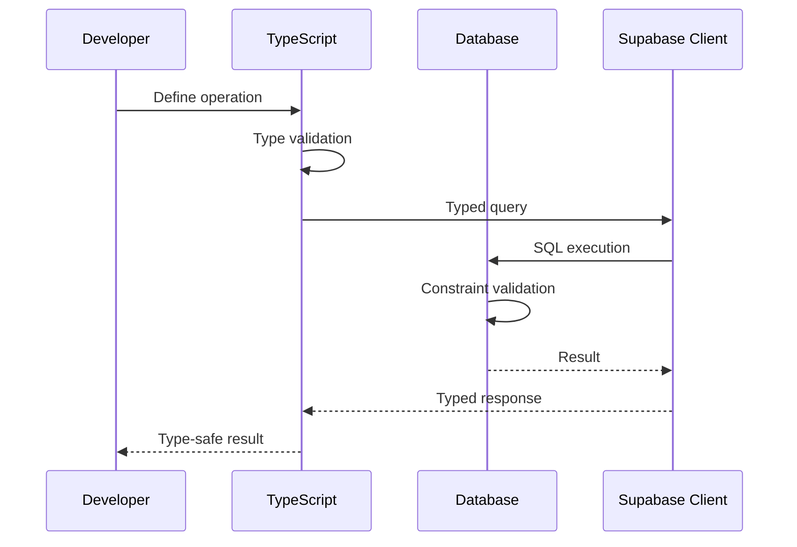

# Enums and Utility Types

<cite>
**Referenced Files in This Document**
- [src/types/database.ts](file://src\types\database.ts)
- [supabase/migrations/20251128220157_remix_migration_from_pg_dump.sql](file://supabase\migrations\20251128220157_remix_migration_from_pg_dump.sql)
- [src/lib/supabaseHelpers.ts](file://src\lib\supabaseHelpers.ts)
- [src/integrations/supabase/client.ts](file://src\integrations\supabase\client.ts)
- [src/types/README.md](file://src\types\README.md)
- [src/vite-env.d.ts](file://src\vite-env.d.ts) - *Updated environment variable type declarations*
- [src/lib/env-validator.ts](file://src\lib\env-validator.ts) - *Environment validation implementation*
</cite>

## Update Summary
**Changes Made**
- Updated Environment Variable Type Safety section to reflect the proper augmentation of ImportMeta interface with ImportMetaEnv
- Added detailed explanation of the updated type declarations in src/vite-env.d.ts
- Enhanced code examples to show the correct type-safe access pattern
- Updated document sources to include the modified src/vite-env.d.ts file
- Removed redundant env.d.ts reference as it has been consolidated into vite-env.d.ts

## Table of Contents
1. [Introduction](#introduction)
2. [Database Enum Types](#database-enum-types)
3. [TypeScript Enum Mappings](#typescript-enum-mappings)
4. [Utility Types for Type Safety](#utility-types-for-type-safety)
5. [Relationship Between Database Constraints and TypeScript Types](#relationship-between-database-constraints-and-typescript-types)
6. [Practical Usage Examples](#practical-usage-examples)
7. [Environment Variable Type Safety](#environment-variable-type-safety)
8. [Best Practices](#best-practices)
9. [Conclusion](#conclusion)

## Introduction

The sleekapp-v100 database employs a comprehensive system of enumerated types and utility types to ensure data integrity and provide type-safe operations across the application stack. This documentation covers the PostgreSQL ENUM types defined in the database schema and their corresponding TypeScript type definitions, along with utility types that enhance developer experience and prevent runtime errors.

The system leverages Supabase's type generation capabilities while maintaining explicit TypeScript interfaces to provide robust type safety for database operations. This approach ensures that business logic constraints are enforced both at the database level and in the frontend application.

Recent updates have significantly enhanced the type safety of the system by properly augmenting the ImportMeta interface with ImportMetaEnv in the src/vite-env.d.ts file. This change resolves TS2339 errors and eliminates redundant type definitions while maintaining type safety for Vite's environment injection system.

**Section sources**
- [src/vite-env.d.ts](file://src\vite-env.d.ts) - *Updated environment variable type declarations*
- [tsconfig.json](file://tsconfig.json) - *Updated with strict mode enabled*
- [tsconfig.app.json](file://tsconfig.app.json) - *Application configuration*

## Database Enum Types

The PostgreSQL database defines several critical ENUM types that govern various aspects of the business domain. These enums are defined in the migration files and serve as the foundation for data validation and business process enforcement.

### Core Application Roles

The `app_role` enum defines the fundamental user role types within the system:



**Diagram sources**
- [supabase/migrations/20251128220157_remix_migration_from_pg_dump.sql](file://supabase\migrations\20251128220157_remix_migration_from_pg_dump.sql#L28-L40)

### Order Workflow Status

The `order_workflow_status` enum tracks the complete lifecycle of orders through the business process:



**Diagram sources**
- [supabase/migrations/20251128220157_remix_migration_from_pg_dump.sql](file://supabase\migrations\20251128220157_remix_migration_from_pg_dump.sql#L47-L65)

### Production Stage Tracking

The `production_stage` enum monitors the manufacturing process through distinct phases:



**Diagram sources**
- [supabase/migrations/20251128220157_remix_migration_from_pg_dump.sql](file://supabase\migrations\20251128220157_remix_migration_from_pg_dump.sql#L72-L80)

### Supplier Verification Status

The `verification_status` enum manages supplier validation states:



**Diagram sources**
- [supabase/migrations/20251128220157_remix_migration_from_pg_dump.sql](file://supabase\migrations\20251128220157_remix_migration_from_pg_dump.sql#L98-L103)

### Additional Enum Types

The system also includes specialized enums for business operations:

| Enum Name | Values | Business Meaning |
|-----------|--------|------------------|
| `batch_status` | filling, confirmed, in_production, completed, cancelled | Production batch lifecycle stages |
| `lead_status` | new, contacted, qualified, proposal, negotiation, closed_won, closed_lost | Sales lead progression |
| `payment_status` | pending, partial, paid, overdue | Invoice payment states |
| `supplier_tier` | bronze, silver, gold | Supplier quality classification |

**Section sources**
- [supabase/migrations/20251128220157_remix_migration_from_pg_dump.sql](file://supabase\migrations\20251128220157_remix_migration_from_pg_dump.sql#L28-L103)

## TypeScript Enum Mappings

The TypeScript definitions mirror the PostgreSQL ENUM types while providing enhanced type safety and developer experience. These mappings ensure compile-time validation of enum values and prevent invalid data insertion.

### Core Role Types

The TypeScript equivalent of `app_role` provides strict type checking:

```typescript
export type AppRole = 'admin' | 'buyer' | 'supplier' | 'factory';
```

This type ensures that only valid role values can be assigned to user accounts, preventing typos and invalid role assignments at compile time.

### Workflow Status Types

The `OrderWorkflowStatus` type encompasses all possible order states with comprehensive typing:

```typescript
export type OrderWorkflowStatus = 
  | 'quote_requested'
  | 'quote_provided'
  | 'quote_accepted'
  | 'assigned_to_supplier'
  | 'in_production'
  | 'quality_check'
  | 'shipped'
  | 'delivered'
  | 'completed';
```

Each status value corresponds to a specific business process state, enabling precise workflow management and state transitions.

### Production Stage Types

The `ProductionStage` type defines manufacturing process phases:

```typescript
export type ProductionStage = 
  | 'yarn_received'
  | 'knitting'
  | 'linking'
  | 'washing_finishing'
  | 'final_qc'
  | 'packing'
  | 'ready_to_ship';
```

This enumeration ensures that production updates correspond to valid manufacturing stages, maintaining process integrity.

**Section sources**
- [src/types/database.ts](file://src\types\database.ts#L5-L31)

## Utility Types for Type Safety

The utility types provide powerful abstractions for database operations, ensuring type safety while maintaining flexibility in data manipulation.

### InsertData<T> Utility Type

The `InsertData<T>` utility type creates type-safe insert operations by excluding auto-generated fields:

```typescript
export type InsertData<T> = Partial<Omit<T, 'id'>> & {
  id?: string;
};
```

This type definition provides several key benefits:

- **Automatic Field Exclusion**: Automatically omits `id`, `created_at`, and `updated_at` fields that are managed by the database
- **Optional ID**: Allows specifying custom IDs when needed, though this is generally discouraged
- **Partial Type Safety**: Ensures only valid fields can be included in insert operations

### UpdateData<T> Utility Type

The `UpdateData<T>` utility type enables safe partial updates:

```typescript
export type UpdateData<T> = Partial<Omit<T, 'id' | 'created_at'>>;
```

This type offers:

- **Partial Updates**: All fields are optional, allowing selective field updates
- **Field Validation**: Prevents modification of immutable fields like `id` and `created_at`
- **Type Safety**: Maintains strong typing while enabling flexible update patterns

### Relationship Interface Types

The system includes specialized types for complex data relationships:

```typescript
export interface OrderWithRelations extends Order {
  supplier?: Supplier;
  order_documents?: OrderDocument[];
  order_messages?: OrderMessage[];
  order_updates?: OrderUpdate[];
}
```

These relationship types enable efficient data fetching with nested associations, reducing the need for multiple queries.

**Section sources**
- [src/types/database.ts](file://src\types\database.ts#L557-L579)

## Relationship Between Database Constraints and TypeScript Types

The TypeScript type system reflects and enhances the database constraint system, creating a robust layer of data integrity protection.

### Database Constraint Enforcement

The PostgreSQL schema enforces constraints through:



**Diagram sources**
- [supabase/migrations/20251128220157_remix_migration_from_pg_dump.sql](file://supabase\migrations\20251128220157_remix_migration_from_pg_dump.sql#L47-L65)

### Frontend Type Reflection

The TypeScript types mirror these constraints:

| Database Constraint | TypeScript Equivalent | Benefit |
|-------------------|----------------------|---------|
| ENUM validation | String literal union types | Compile-time validation |
| CHECK constraints | Custom type guards | Runtime validation |
| Foreign keys | Interface relationships | Type-safe joins |
| NOT NULL | Required property markers | Null safety |

### Type Safety Pipeline

The type safety operates through multiple layers:



**Section sources**
- [src/lib/supabaseHelpers.ts](file://src\lib\supabaseHelpers.ts#L1-L376)

## Practical Usage Examples

The utility types and enum mappings are extensively used throughout the application for various database operations.

### Creating New Records with InsertData<T>

```typescript
// Example: Creating a new notification
import type { InsertData, Notification } from '@/types/database';

const newNotification: InsertData<Notification> = {
  user_id: userId,
  type: 'order_update',
  title: 'Order Status Changed',
  message: 'Your order has moved to the next stage',
  read: false,
};

const { data: created, error } = await notificationHelpers.create(newNotification);
```

### Updating Records with UpdateData<T>

```typescript
// Example: Updating order status
import type { UpdateData, Order } from '@/types/database';

const updates: UpdateData<Order> = {
  status: 'shipped',
  tracking_number: 'TRACK123456789',
  updated_at: new Date().toISOString(),
};

const { data: updated, error } = await supabase
  .from('orders')
  .update(updates)
  .eq('id', orderId)
  .select()
  .single();
```

### Working with Enum Values

```typescript
// Example: Processing order workflow transitions
async function advanceOrderWorkflow(orderId: string, newStatus: OrderWorkflowStatus) {
  const { error } = await orderHelpers.updateStatus(orderId, newStatus);
  
  if (!error && newStatus === 'completed') {
    // Trigger completion logic
    await processOrderCompletion(orderId);
  }
}
```

### Type-Safe Helper Functions

The system provides pre-built helper functions that leverage the utility types:

```typescript
// Orders helper with type inference
const { data: order } = await orderHelpers.getWithRelations(orderId);

// Notifications helper with type safety
const { data: notifications } = await notificationHelpers.getByUserId(userId);

// Supplier helper with enum validation
const { data: verifiedSuppliers } = await supplierHelpers.getVerified();
```

### Optimistic Updates with Type Safety

```typescript
// Example: Optimistic order status update
const { mutate: updateOrderStatus } = useUpdateOrderStatus();

updateOrderStatus({
  orderId: 'order-123',
  status: 'in_production',
  notes: 'Starting manufacturing process'
});
```

**Section sources**
- [src/lib/supabaseHelpers.ts](file://src\lib\supabaseHelpers.ts#L141-L148)
- [src/hooks/queries/useOrders.ts](file://src\hooks\queries\useOrders.ts#L110-L151)

## Environment Variable Type Safety

The updated `src/vite-env.d.ts` file properly augments the ImportMeta interface with ImportMetaEnv, resolving TS2339 errors and eliminating redundant type definitions while maintaining type safety for Vite's environment injection system.

### Updated vite-env.d.ts Implementation

The updated type declaration file defines the expected environment variables with proper typing:

```typescript
/// <reference types="vite/client" />

declare global {
  interface ImportMetaEnv {
    readonly VITE_SUPABASE_URL: string
    readonly VITE_SUPABASE_PUBLISHABLE_KEY: string
    readonly VITE_SUPABASE_PROJECT_ID: string
    readonly VITE_STRIPE_PUBLISHABLE_KEY: string
  }

  interface ImportMeta {
    readonly env: ImportMetaEnv
  }
}

export {}
```

This declaration properly augments the global scope with the ImportMeta interface and ImportMetaEnv type, ensuring that all environment variables are type-safe and accessible throughout the application without requiring redundant type definitions.

The key improvements in this update include:

1. **Proper Interface Augmentation**: The ImportMeta interface is correctly extended with the env property of type ImportMetaEnv
2. **Global Declaration**: The interfaces are declared in the global scope, making them available throughout the application
3. **Type Safety**: All environment variables are strongly typed, preventing runtime errors from misspelled or undefined variables
4. **Elimination of Redundancy**: Removes the need for separate env.d.ts files by consolidating type declarations

### Environment Validation

The system includes a robust environment validation mechanism that checks required variables at startup:

```typescript
class EnvironmentValidator {
  private errors: string[] = [];

  validate(): void {
    this.validateRequired('VITE_SUPABASE_URL');
    this.validateUrl('VITE_SUPABASE_URL');
    this.validateSupabaseKey('VITE_SUPABASE_PUBLISHABLE_KEY');
    
    if (this.errors.length > 0) {
      throw new Error(`Environment validation failed:\n${this.errors.join('\n')}`);
    }
  }

  private validateRequired(key: string): void {
    const value = import.meta.env[key];
    if (!value || value.trim() === '') {
      this.errors.push(`❌ Missing required environment variable: ${key}`);
    }
  }
}
```

This validation ensures that critical configuration is present and correctly formatted before the application starts.

### Usage in Application Code

The properly typed environment variables are used throughout the application:

```typescript
// In src/integrations/supabase/client.ts
const SUPABASE_URL = import.meta.env.VITE_SUPABASE_URL;
const SUPABASE_PUBLISHABLE_KEY = import.meta.env.VITE_SUPABASE_PUBLISHABLE_KEY;

export const supabase = createClient<Database>(SUPABASE_URL, SUPABASE_PUBLISHABLE_KEY, {
  auth: {
    storage: localStorage,
    persistSession: true,
    autoRefreshToken: true,
  }
});
```

The updated type declarations ensure that accessing `import.meta.env.VITE_SUPABASE_URL` is type-safe and will not produce TS2339 errors.

**Section sources**
- [src/vite-env.d.ts](file://src\vite-env.d.ts) - *Updated environment variable type declarations*
- [src/lib/env-validator.ts](file://src\lib\env-validator.ts) - *Validation implementation*
- [src/integrations/supabase/client.ts](file://src\integrations\supabase\client.ts) - *Usage of environment variables*

## Best Practices

### Type Safety Guidelines

1. **Always Use Utility Types**: Prefer `InsertData<T>` and `UpdateData<T>` over manual type definitions
2. **Leverage Helper Functions**: Use the provided helper functions for common operations
3. **Enable Strict Mode**: Configure TypeScript with strict type checking enabled as in `tsconfig.json`
4. **Validate at Multiple Layers**: Combine database constraints with TypeScript validation
5. **Use Environment Validation**: Always validate environment variables before use
6. **Maintain Type Definitions**: Keep `vite-env.d.ts` updated with current requirements

### Performance Considerations

- **Selective Field Updates**: Use `UpdateData<T>` to minimize unnecessary field updates
- **Efficient Queries**: Leverage relationship interfaces to reduce query complexity
- **Index Optimization**: Ensure database indexes align with common query patterns
- **Tree Shaking**: Configure bundler to eliminate unused type definitions

### Error Handling Strategies

```typescript
// Example: Robust error handling with type safety
try {
  const { data, error } = await notificationHelpers.create(notificationData);
  
  if (error) {
    throw new Error(`Failed to create notification: ${error.message}`);
  }
  
  return data;
} catch (error) {
  console.error('Notification creation failed:', error);
  throw error;
}
```

### Testing Approaches

```typescript
// Example: Type-safe testing
describe('Order Status Updates', () => {
  it('should accept valid workflow statuses', async () => {
    const validStatuses: OrderWorkflowStatus[] = [
      'quote_requested',
      'in_production',
      'completed'
    ];
    
    for (const status of validStatuses) {
      const result = await updateOrderStatus(orderId, status);
      expect(result).toBe(true);
    }
  });
});
```

**Section sources**
- [src/types/README.md](file://src\types\README.md#L192-L239)
- [tsconfig.json](file://tsconfig.json) - *Strict mode configuration*
- [src/vite-env.d.ts](file://src\vite-env.d.ts) - *Environment typing best practices*

## Conclusion

The sleekapp-v100 database employs a sophisticated system of enumerated types and utility types that provides comprehensive type safety and data integrity. The PostgreSQL ENUM types define the business domain constraints, while the TypeScript equivalents ensure compile-time validation and developer productivity.

The utility types (`InsertData<T>` and `UpdateData<T>`) offer powerful abstractions that simplify database operations while maintaining strict type safety. The relationship interfaces enable efficient data modeling with nested associations, reducing query complexity and improving application performance.

Recent enhancements have significantly strengthened the type safety of the system by properly updating the environment variable type declarations in `src/vite-env.d.ts`. This change resolves TS2339 errors and eliminates redundant type definitions while maintaining type safety for Vite's environment injection system. The updated type declarations properly augment the ImportMeta interface with ImportMetaEnv, ensuring that all environment variables are type-safe and accessible throughout the application.

This dual-layer approach—combining database constraints with TypeScript type definitions—creates a robust system that prevents data corruption while providing excellent developer experience. The extensive use of helper functions and validation utilities further enhances productivity by providing type-safe, pre-built solutions for common database operations.

The system's design demonstrates best practices in modern web application development, where type safety and data integrity are prioritized alongside developer convenience and application performance. This approach serves as a model for building scalable, maintainable applications that can grow with evolving business requirements while maintaining data consistency and reliability.