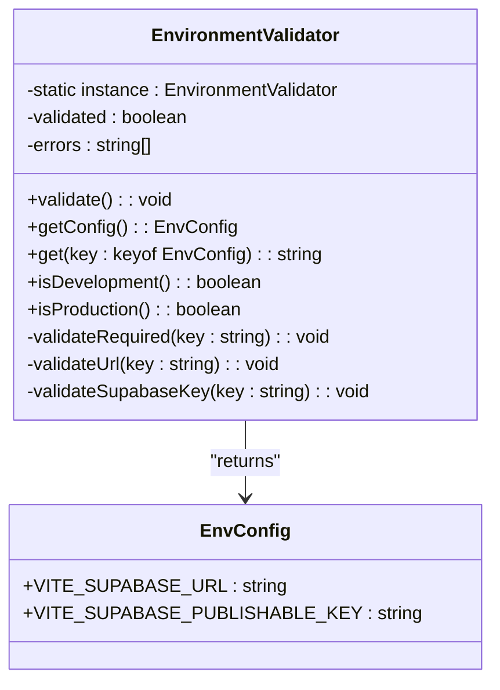

# Environment Variables & Configuration

<cite>
**Referenced Files in This Document**   
- [vite.config.ts](file://vite.config.ts)
- [env-validator.ts](file://src\lib\env-validator.ts)
- [client.ts](file://src\integrations\supabase\client.ts)
- [diagnostics.ts](file://src\lib\diagnostics.ts)
- [netlify.toml](file://netlify.toml)
- [vercel.json](file://vercel.json)
- [setup-database.js](file://scripts\setup-database.js)
- [stripe-webhook/index.ts](file://supabase\functions\stripe-webhook\index.ts)
- [ai-quote-generator/index.ts](file://supabase\functions\ai-quote-generator\index.ts)
- [vite-env.d.ts](file://src\vite-env.d.ts) - *Updated environment typing*
</cite>

## Update Summary
**Changes Made**   
- Updated Vite environment variable processing section to reflect removal of hardcoded values in vite.config.ts
- Updated environment validation mechanism section to reflect consolidation of environment typing into Vite's standard mechanism
- Added information about the new vite-env.d.ts file that replaces the standalone env.d.ts
- Removed references to Firebase integration which has been removed
- Updated code examples to reflect current implementation without hardcoded Supabase URL and publishable key definitions

## Table of Contents
1. [Introduction](#introduction)
2. [Environment Types and Configuration Needs](#environment-types-and-configuration-needs)
3. [Vite Environment Variable Processing](#vite-environment-variable-processing)
4. [Environment Validation Mechanism](#environment-validation-mechanism)
5. [Secure Handling of Sensitive Keys](#secure-handling-of-sensitive-keys)
6. [Practical Configuration Examples](#practical-configuration-examples)
7. [Common Issues and Troubleshooting](#common-issues-and-troubleshooting)
8. [Best Practices for Multi-Platform Management](#best-practices-for-multi-platform-management)
9. [Conclusion](#conclusion)

## Introduction
The sleekapp-v100 application implements a robust environment variable management system to support different deployment environments while maintaining security and consistency. This document provides comprehensive guidance on environment variable configuration, validation, and best practices across development, preview, and production environments. The system leverages Vite's environment variable processing capabilities combined with custom validation logic to ensure proper configuration before application execution. Recent updates have removed Firebase integration and consolidated environment typing into Vite's standard mechanism, simplifying the configuration process.

## Environment Types and Configuration Needs
The application supports three primary environment types: development, preview, and production, each with distinct configuration requirements.

### Development Environment
The development environment (DEV) is designed for local development and testing. It uses default values for critical environment variables when not explicitly set, allowing developers to start the application quickly without requiring immediate configuration of all environment variables. The environment is identified by `import.meta.env.DEV` being true.

### Preview Environment
The preview environment is used for staging and testing deployments, typically on platforms like Vercel or Netlify. This environment requires fully configured environment variables that mirror production settings but may point to staging infrastructure. It's identified by `import.meta.env.MODE` being set to 'preview'.

### Production Environment
The production environment (PROD) has the strictest requirements, with mandatory validation of all environment variables at startup. When `import.meta.env.PROD` is true, the application automatically validates environment variables and will fail fast if any required variables are missing or invalid. This ensures that production deployments are properly configured before serving traffic.

**Section sources**
- [env-validator.ts](file://src\lib\env-validator.ts#L117-L127)
- [vite.config.ts](file://vite.config.ts#L11)

## Vite Environment Variable Processing
The application leverages Vite's environment variable processing system with specific implementation patterns in the vite.config.ts file.

### VITE_ Prefix Requirement
Vite only exposes environment variables to the client-side code when they are prefixed with `VITE_`. This security feature prevents accidental exposure of sensitive server-side variables. In sleekapp-v100, the following variables are exposed to the client:

- `VITE_SUPABASE_URL`: The Supabase project URL
- `VITE_SUPABASE_PUBLISHABLE_KEY`: The Supabase public API key
- `VITE_STRIPE_PUBLISHABLE_KEY`: The Stripe public API key
- `VITE_BUILD_ID`: A timestamp-based build identifier

### Server-Side Variable Injection
The vite.config.ts file no longer contains hardcoded Supabase URL and publishable key definitions. Instead, it relies entirely on environment variables provided at build time:

```typescript
define: {
  'import.meta.env.VITE_BUILD_ID': JSON.stringify(Date.now().toString()),
}
```

This change simplifies the configuration by removing hardcoded values and ensuring that all environment variables are consistently managed through Vite's standard mechanism. The application now depends on proper environment variable setup rather than fallback values in the configuration file.

**Section sources**
- [vite.config.ts](file://vite.config.ts#L79-L81)

## Environment Validation Mechanism
The application implements a comprehensive environment validation system through the env-validator.ts module to ensure proper configuration before runtime execution.

### Consolidated Environment Typing
The environment typing has been consolidated into Vite's standard mechanism using the vite-env.d.ts file, which replaces the standalone env.d.ts file:

```typescript
declare global {
  interface ImportMetaEnv {
    readonly VITE_SUPABASE_URL: string
    readonly VITE_SUPABASE_PUBLISHABLE_KEY: string
    readonly VITE_SUPABASE_PROJECT_ID: string
    readonly VITE_STRIPE_PUBLISHABLE_KEY: string
  }

  interface ImportMeta {
    readonly env: ImportMetaEnv
  }
}
```

This approach provides type safety for environment variables directly within Vite's ecosystem, eliminating the need for a separate type definition file and ensuring consistency across the application.

### Validation Process
The validation process occurs in several stages:

1. **Required Variable Check**: Verifies that essential variables like `VITE_SUPABASE_URL` and `VITE_SUPABASE_PUBLISHABLE_KEY` are present and non-empty
2. **Format Validation**: Checks that URLs are properly formatted using the URL constructor
3. **Key Format Validation**: Performs basic validation on Supabase keys to ensure they have a reasonable length (minimum 20 characters)

The validation is automatically triggered in production mode when the module is imported, ensuring fail-fast behavior for misconfigured production deployments.

### Configuration Access
The validator provides multiple methods to access environment configuration safely:

- `getConfig()`: Returns a typed configuration object with validated values
- `get(key)`: Retrieves a specific environment variable with automatic validation
- `isDevelopment()` and `isProduction()`: Helper methods to check the current environment mode

This layered approach ensures that environment variables are always validated before use, preventing runtime errors due to missing or invalid configuration.



**Diagram sources**
- [env-validator.ts](file://src\lib\env-validator.ts#L6-L128)
- [vite-env.d.ts](file://src\vite-env.d.ts)

**Section sources**
- [env-validator.ts](file://src\lib\env-validator.ts#L1-L142)
- [vite-env.d.ts](file://src\vite-env.d.ts)

## Secure Handling of Sensitive Keys
The application implements multiple strategies to securely handle sensitive keys, particularly the Supabase SERVICE_ROLE_KEY.

### Client-Side vs Server-Side Separation
Sensitive keys like `SUPABASE_SERVICE_ROLE_KEY` are never exposed to the client-side application. They are only used in server-side contexts:

- **Edge Functions**: Supabase functions in the `/supabase/functions` directory access the service role key through `Deno.env.get('SUPABASE_SERVICE_ROLE_KEY')`
- **Database Scripts**: The setup-database.js script accepts the service role key as a command-line argument rather than reading it from environment files

### Service Role Key Usage
The SERVICE_ROLE_KEY is used in server-side operations that require elevated privileges, such as:

- Creating payment intents
- Processing webhook events
- Generating invoices
- Executing automation rules

For example, in the stripe-webhook function:

```typescript
const supabase = createClient(
  Deno.env.get('SUPABASE_URL') ?? '',
  Deno.env.get('SUPABASE_SERVICE_ROLE_KEY') ?? ''
);
```

This pattern ensures that sensitive operations can bypass Row Level Security (RLS) policies when necessary, while maintaining security by keeping the key out of client-side code.

### Environment Variable Protection
The application follows security best practices by:

1. Never hardcoding sensitive keys in source files
2. Using environment variables for all sensitive configuration
3. Validating the presence of required environment variables before use
4. Providing clear error messages with guidance for fixing configuration issues

**Section sources**
- [stripe-webhook/index.ts](file://supabase\functions\stripe-webhook\index.ts#L17-L18)
- [setup-database.js](file://scripts\setup-database.js#L15)
- [ai-quote-generator/index.ts](file://supabase\functions\ai-quote-generator/index.ts#L228)

## Practical Configuration Examples
This section provides practical examples for configuring the application in different environments.

### Local Development Setup
For local development, create a `.env.local` file in the project root:

```env
VITE_SUPABASE_URL=https://your-project.supabase.co
VITE_SUPABASE_PUBLISHABLE_KEY=your-public-anon-key
VITE_STRIPE_PUBLISHABLE_KEY=pk_test_your_stripe_key
```

Start the development server with:
```bash
npm run dev
```

The application will use these values, with no fallback to hardcoded values in vite.config.ts.

### Production Deployment on Vercel
For Vercel deployments, configure environment variables through the Vercel dashboard or CLI:

```bash
vercel env add VITE_SUPABASE_URL production
vercel env add VITE_SUPABASE_PUBLISHABLE_KEY production  
vercel env add VITE_STRIPE_PUBLISHABLE_KEY production
```

The vercel.json file configures routing for the application:

```json
{
  "rewrites": [
    { "source": "/(.*)", "destination": "/index.html" }
  ]
}
```

### Production Deployment on Netlify
For Netlify deployments, configure environment variables in the Netlify dashboard or through netlify.toml:

```toml
[build.environment]
  VITE_SUPABASE_URL = "https://your-project.supabase.co"
  VITE_SUPABASE_PUBLISHABLE_KEY = "your-public-anon-key"
  VITE_STRIPE_PUBLISHABLE_KEY = "pk_live_your_stripe_key"
```

The netlify.toml file also configures asset caching and security headers:

```toml
[[headers]]
  for = "/*"
  [headers.values]
    X-Frame-Options = "DENY"
    X-Content-Type-Options = "nosniff"
```

**Section sources**
- [vercel.json](file://vercel.json)
- [netlify.toml](file://netlify.toml)
- [vite.config.ts](file://vite.config.ts)

## Common Issues and Troubleshooting
This section addresses common issues related to environment variable management and their solutions.

### Accidentally Exposing Secrets
**Issue**: Sensitive keys like SERVICE_ROLE_KEY are accidentally exposed to client-side code.

**Solution**: Ensure that only variables prefixed with `VITE_` are used in client-side code. Never create environment variables like `VITE_SUPABASE_SERVICE_ROLE_KEY`. Use edge functions for server-side operations requiring elevated privileges.

### Missing Environment Variables in CI/CD
**Issue**: Environment variables are not properly configured in CI/CD pipelines, causing build or runtime failures.

**Solution**: Implement validation in the build process:

```typescript
// In diagnostics.ts
export const checkEnvironmentVariables = async (): Promise<DiagnosticResult> => {
  const required = ['VITE_SUPABASE_URL', 'VITE_SUPABASE_PUBLISHABLE_KEY'];
  const missing = required.filter(key => !import.meta.env[key]);
  // ...
};
```

Add this check to your CI/CD pipeline to catch configuration issues early.

### Type Mismatches in Configuration Values
**Issue**: Environment variables are expected to be of a certain type but receive invalid values.

**Solution**: Implement validation logic as seen in env-validator.ts:

```typescript
private validateUrl(key: string): void {
  const value = import.meta.env[key];
  if (!value) return;
  
  try {
    new URL(value);
  } catch {
    this.errors.push(`❌ Invalid URL format for ${key}: ${value}`);
  }
}
```

This proactive validation prevents runtime errors due to malformed configuration.

**Section sources**
- [env-validator.ts](file://src\lib\env-validator.ts#L67-L76)
- [diagnostics.ts](file://src\lib\diagnostics.ts#L103-L119)

## Best Practices for Multi-Platform Management
This section outlines best practices for managing environment variables across different platforms.

### Consistent Variable Naming
Use consistent naming conventions across all platforms:
- Prefix all client-side variables with `VITE_`
- Use uppercase with underscores for all environment variable names
- Maintain the same variable names across development, staging, and production

### Platform-Specific Configuration
Leverage platform-specific configuration files:
- **Vercel**: Use vercel.json for routing and environment configuration
- **Netlify**: Use netlify.toml for redirects, headers, and environment variables  
- **Local Development**: Use .env.local (git-ignored) for local configuration

### Secure Key Management
Implement secure key management practices:
- Store sensitive keys in platform-specific secret management systems
- Rotate keys periodically and update them across all environments
- Use different keys for development, staging, and production environments
- Never commit environment files with sensitive values to version control

### Automated Validation
Implement automated validation at multiple levels:
- **Build Time**: Validate critical variables during the build process
- **Startup**: Validate configuration when the application starts
- **Runtime**: Perform periodic health checks that verify configuration integrity

The diagnostics.ts module provides a comprehensive health check system that verifies environment variables along with other critical components:

```typescript
export const checkEnvironmentVariables = async (): Promise<DiagnosticResult> => {
  const required = ['VITE_SUPABASE_URL', 'VITE_SUPABASE_PUBLISHABLE_KEY'];
  const missing = required.filter(key => !import.meta.env[key]);
  // ...
};
```

**Section sources**
- [netlify.toml](file://netlify.toml)
- [vercel.json](file://vercel.json)
- [diagnostics.ts](file://src\lib\diagnostics.ts#L103-L119)

## Conclusion
The environment variable management system in sleekapp-v100 provides a robust foundation for secure and reliable application deployment across multiple environments. By leveraging Vite's built-in environment variable processing, implementing comprehensive validation through the EnvironmentValidator class, and following security best practices for handling sensitive keys, the application ensures consistent behavior while minimizing configuration-related errors.

Key takeaways include:
- Always prefix client-side environment variables with `VITE_`
- Implement automated validation to catch configuration issues early
- Keep sensitive keys like SERVICE_ROLE_KEY out of client-side code
- Use platform-specific configuration files for optimal deployment
- Implement comprehensive diagnostics to verify environment health

By following these practices, developers can ensure smooth operation of the application across development, preview, and production environments while maintaining high security standards.