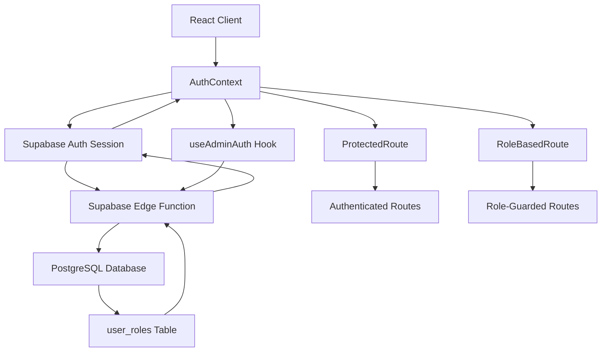
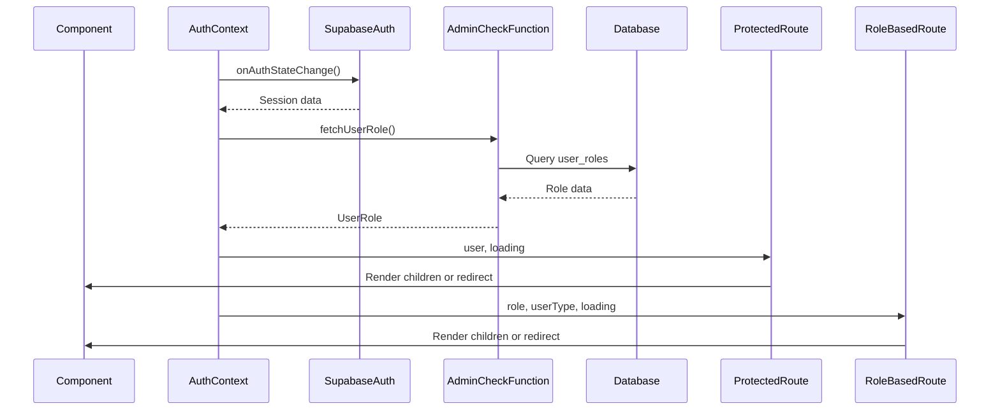
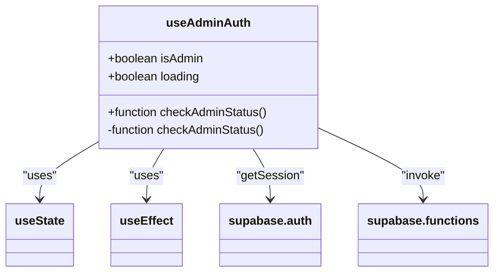
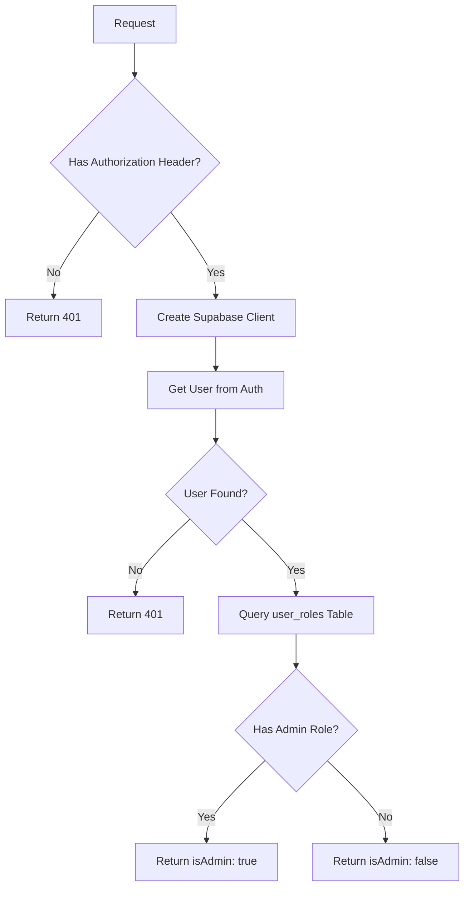
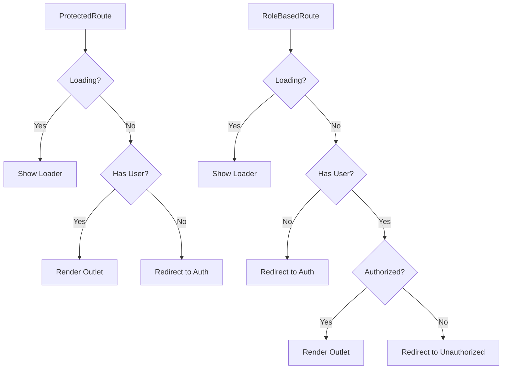

# Frontend Role Validation

<cite>
**Referenced Files in This Document**   
- [useAdminAuth.ts](file://src/hooks/useAdminAuth.ts)
- [admin-check/index.ts](file://supabase/functions/admin-check/index.ts)
- [AdminLayout.tsx](file://src/pages/admin/AdminLayout.tsx)
- [SmartDashboardRouter.tsx](file://src/components/SmartDashboardRouter.tsx)
- [ProductionTracking.tsx](file://src/pages/ProductionTracking.tsx)
- [database.ts](file://src/types/database.ts)
- [BASE_MIGRATION_SAFE.sql](file://supabase/BASE_MIGRATION_SAFE.sql)
- [AuthContext.tsx](file://src/contexts/AuthContext.tsx) - *Added in recent commit*
- [ProtectedRoute.tsx](file://src/components/routes/ProtectedRoute.tsx) - *Added in recent commit*
- [RoleBasedRoute.tsx](file://src/components/routes/RoleBasedRoute.tsx) - *Added in recent commit*
- [App.tsx](file://src/App.tsx) - *Updated to include new routing components*
</cite>

## Update Summary
**Changes Made**   
- Added comprehensive documentation for the new AuthContext.tsx providing centralized authentication state management
- Added detailed sections on ProtectedRoute and RoleBasedRoute components for authentication and role-based access control
- Updated domain model to reflect the new context-based architecture
- Enhanced integration examples with updated routing patterns
- Added new architectural diagrams reflecting the updated component relationships
- Updated section sources to include newly added files and their specific line ranges

## Table of Contents
1. [Introduction](#introduction)
2. [Domain Model and Architecture](#domain-model-and-architecture)
3. [Core Implementation Details](#core-implementation-details)
4. [useAdminAuth Hook Analysis](#useadminauth-hook-analysis)
5. [Server-Side Role Verification](#server-side-role-verification)
6. [Integration with Protected Routes](#integration-with-protected-routes)
7. [UI Element Visibility Control](#ui-element-visibility-control)
8. [Common Issues and Solutions](#common-issues-and-solutions)
9. [Security Considerations](#security-considerations)
10. [Testing Strategy](#testing-strategy)

## Introduction
Frontend role validation in the SleekApparels application implements a secure, multi-layered approach to user privilege management using React hooks, context providers, and Supabase edge functions. This system ensures that administrative functionality is only accessible to authorized users while maintaining a responsive user experience. The implementation follows security best practices by never trusting client-side data for role validation and instead relying on server-side verification through Supabase edge functions. This documentation provides a comprehensive analysis of the role validation system, covering its architecture, implementation details, and integration patterns across the application.

## Domain Model and Architecture
The role validation system operates on a clear domain model that separates concerns between client-side state management and server-side authorization. The architecture follows a three-tier pattern: client-side React components manage UI state and user experience, Supabase edge functions handle secure role verification, and the PostgreSQL database maintains the authoritative source of user roles. The recent addition of AuthContext.tsx provides centralized authentication state management across the application.

**Diagram sources**
- [AuthContext.tsx](file://src/contexts/AuthContext.tsx#L1-L165)
- [ProtectedRoute.tsx](file://src/components/routes/ProtectedRoute.tsx#L1-L35)
- [RoleBasedRoute.tsx](file://src/components/routes/RoleBasedRoute.tsx#L1-L59)
- [admin-check/index.ts](file://supabase/functions/admin-check/index.ts#L8-L73)

**Section sources**
- [AuthContext.tsx](file://src/contexts/AuthContext.tsx#L1-L165)
- [ProtectedRoute.tsx](file://src/components/routes/ProtectedRoute.tsx#L1-L35)
- [RoleBasedRoute.tsx](file://src/components/routes/RoleBasedRoute.tsx#L1-L59)
- [database.ts](file://src/types/database.ts#L6-L6)

## Core Implementation Details
The role validation system implements a robust pattern for verifying user privileges that combines client-side React context with server-side Supabase edge functions. The core implementation now revolves around the AuthContext, which manages the authentication state and provides a centralized interface for components to access user roles and authentication status. This context integrates with Supabase's authentication system to obtain the current session and then invokes the admin-check edge function to verify the user's role on the server side.

The system is designed to handle various edge cases, including expired sessions, network errors, and concurrent requests. It implements proper error handling and loading states to ensure a smooth user experience while maintaining security. The implementation follows React best practices with proper useEffect dependency management and state updates. The new ProtectedRoute and RoleBasedRoute components provide declarative route protection based on authentication status and user roles.

**Diagram sources**
- [AuthContext.tsx](file://src/contexts/AuthContext.tsx#L121-L145)
- [ProtectedRoute.tsx](file://src/components/routes/ProtectedRoute.tsx#L18-L34)
- [RoleBasedRoute.tsx](file://src/components/routes/RoleBasedRoute.tsx#L24-L58)
- [admin-check/index.ts](file://supabase/functions/admin-check/index.ts#L8-L73)

**Section sources**
- [AuthContext.tsx](file://src/contexts/AuthContext.tsx#L1-L165)
- [ProtectedRoute.tsx](file://src/components/routes/ProtectedRoute.tsx#L1-L35)
- [RoleBasedRoute.tsx](file://src/components/routes/RoleBasedRoute.tsx#L1-L59)
- [admin-check/index.ts](file://supabase/functions/admin-check/index.ts#L1-L73)

## useAdminAuth Hook Analysis
The useAdminAuth hook is a custom React hook that encapsulates the logic for checking administrative privileges. It uses React's useState and useEffect hooks to manage component state and side effects. The hook returns an object containing three properties: isAdmin (boolean indicating admin status), loading (boolean indicating verification progress), and checkAdminStatus (function to manually recheck admin status).

The hook implements several important patterns:
- Automatic role verification on component mount via useEffect with empty dependency array
- Proper error handling with try-catch blocks and error logging
- Loading state management to prevent UI flicker
- Manual recheck capability for dynamic role changes

**Diagram sources**
- [useAdminAuth.ts](file://src/hooks/useAdminAuth.ts#L5-L46)

**Section sources**
- [useAdminAuth.ts](file://src/hooks/useAdminAuth.ts#L1-L46)

## Server-Side Role Verification
The server-side role verification is implemented through a Supabase edge function named admin-check. This function runs in a secure server environment and queries the database directly to verify the user's role. The function implements several security measures:

1. CORS headers for cross-origin requests
2. Authorization header validation
3. Secure database connection using Supabase client
4. Direct database query to the user_roles table

The edge function follows the principle of least privilege by only returning a boolean isAdmin value without exposing any additional user information. It also implements proper error handling and returns appropriate HTTP status codes for different error conditions.

**Diagram sources**
- [admin-check/index.ts](file://supabase/functions/admin-check/index.ts#L8-L73)

**Section sources**
- [admin-check/index.ts](file://supabase/functions/admin-check/index.ts#L1-L73)

## Integration with Protected Routes
The role validation system integrates with protected routes through the ProtectedRoute and RoleBasedRoute components, which serve as route guards for authenticated and role-protected functionality. These components use the useAuth hook from AuthContext to determine whether the current user is authenticated and has the required roles.

The ProtectedRoute component ensures users are authenticated before accessing protected content, while RoleBasedRoute provides granular control based on specific roles or user types. Both components handle loading states to prevent flash-of-content issues and ensure a smooth user experience. These components are used as wrappers for various routes in the application, providing a consistent security layer.

**Diagram sources**
- [ProtectedRoute.tsx](file://src/components/routes/ProtectedRoute.tsx#L18-L34)
- [RoleBasedRoute.tsx](file://src/components/routes/RoleBasedRoute.tsx#L24-L58)

**Section sources**
- [ProtectedRoute.tsx](file://src/components/routes/ProtectedRoute.tsx#L1-L35)
- [RoleBasedRoute.tsx](file://src/components/routes/RoleBasedRoute.tsx#L1-L59)
- [App.tsx](file://src/App.tsx#L211-L242)

## UI Element Visibility Control
Beyond route protection, the role validation system enables fine-grained control over UI element visibility based on user roles. Components throughout the application can use the useAuth hook to conditionally render role-specific features, buttons, and data visualizations.

For example, the AdminAuditLogs component only renders content when the user has admin privileges, while other components may show additional buttons or controls for administrative users. This pattern allows for a consistent user interface that adapts to the user's privileges without requiring separate components for different user types.

**Section sources**
- [AdminAuditLogs.tsx](file://src/pages/AdminAuditLogs.tsx#L41-L78)
- [AdminSidebar.tsx](file://src/components/AdminSidebar.tsx#L1-L69)

## Common Issues and Solutions
The role validation system addresses several common issues in role-based access control:

### Stale Role State
One common issue is stale role state, where the client-side role information becomes outdated. The system addresses this through:
- Manual recheck capability via the refreshAuth function in AuthContext
- Proper useEffect dependency management with auth state change listeners
- Server-side validation on every role check
- Real-time updates through Supabase's onAuthStateChange listener

### Race Conditions
The implementation prevents race conditions by:
- Using proper async/await patterns
- Ensuring loading state is set before and after async operations
- Using finally blocks to ensure loading state is always reset
- Centralized state management in AuthContext to prevent conflicting updates

### Network Errors
The system gracefully handles network errors by:
- Implementing comprehensive try-catch blocks
- Logging errors for debugging
- Setting appropriate default states (non-admin) on error
- Providing fallback UI states during loading and error conditions

**Section sources**
- [AuthContext.tsx](file://src/contexts/AuthContext.tsx#L76-L105)
- [useAdminAuth.ts](file://src/hooks/useAdminAuth.ts#L14-L43)
- [useAdminAuth.test.ts](file://src/hooks/__tests__/useAdminAuth.test.ts#L1-L381)

## Security Considerations
The role validation system implements several important security measures:

1. **Server-Side Validation**: Never trust client-side data for role verification
2. **Bearer Token Authentication**: Secure transmission of authentication tokens
3. **CORS Protection**: Proper CORS headers to prevent unauthorized access
4. **Error Handling**: Generic error messages to prevent information leakage
5. **Database Security**: Direct database queries with proper authorization
6. **Centralized State Management**: AuthContext prevents unauthorized state manipulation
7. **Role-Based Access Control**: Granular control through RoleBasedRoute component

The system follows the principle of least privilege by only exposing the minimum necessary information (isAdmin boolean) to the client side. It also implements proper session validation and handles expired sessions appropriately.

**Section sources**
- [admin-check/index.ts](file://supabase/functions/admin-check/index.ts#L1-L73)
- [AuthContext.tsx](file://src/contexts/AuthContext.tsx#L47-L64)
- [useAdminAuth.test.ts](file://src/hooks/__tests__/useAdminAuth.test.ts#L322-L378)

## Testing Strategy
The role validation system includes comprehensive testing through the useAdminAuth.test.ts file. The tests cover various scenarios including:
- Successful admin verification
- Non-admin user verification
- No session scenarios
- Error handling
- Network failures
- Concurrent requests
- Security checks

The tests use mocking to simulate Supabase client behavior and verify that the hook interacts correctly with the authentication system and edge functions. This ensures the reliability and security of the role validation system.

**Section sources**
- [useAdminAuth.test.ts](file://src/hooks/__tests__/useAdminAuth.test.ts#L1-L381)